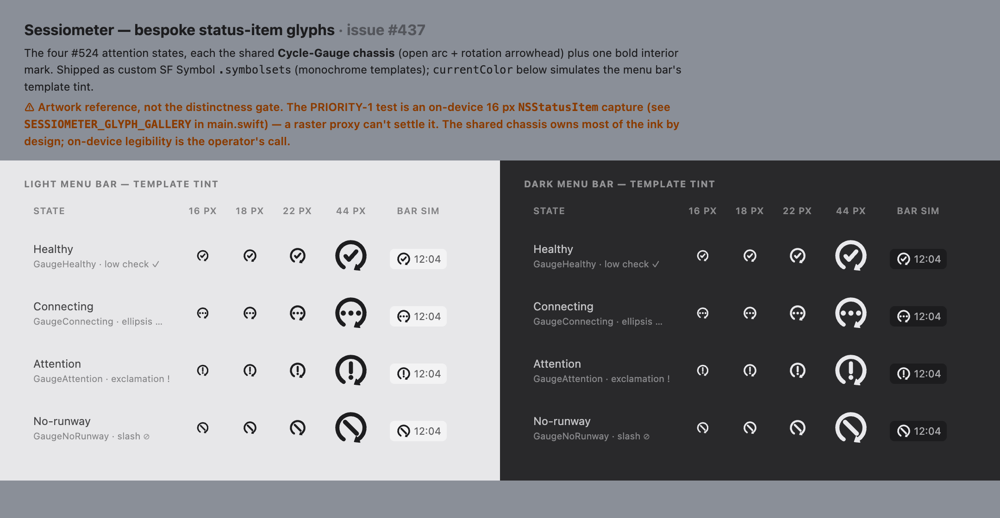
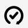

# Menubar design reference

The canonical **visual** build-reference for the SwiftUI menubar panel (see #168 / #169).
`menubar-preview.html` is a single self-contained mock of **all 9 launch-or-attach states**
(light + dark) in the intended native macOS language, plus a **capture-affordance interaction-states**
reference card (pending / done / error) for the in-app "Capture active account" action (#360).


## Viewing it

- **Interactive / most faithful** — open the HTML in a browser: `open menubar-preview.html`
- **At a glance** — `renders/all-states.png` above, rendered from the HTML.

## Regenerating the render

The mock uses `backdrop-filter` vibrancy, which needs **GPU compositing**. Render with a
GPU-enabled headless Chrome — do **not** pass `--disable-gpu` (it forces software rendering and
blacks out the vibrancy). Run from this directory:

```sh
"/Applications/Google Chrome.app/Contents/MacOS/Google Chrome" \
  --headless=new --hide-scrollbars --force-device-scale-factor=1.5 \
  --window-size=1200,8600 --screenshot=renders/all-states.png \
  menubar-preview.html
```

(Bump the `--window-size` height if the page ever grows past it — the committed render is
1800×12900 at this `8600` height × the `1.5` device scale; a shorter height clips the notes.)

## Rendering the BUILT panel (design-parity check)

The mock is the reference; the **built** SwiftUI panel is what ships. To verify the panel actually
matches the mock — the check whose absence let the panel drift (#355) — render the real
`StatusPanelView` to PNG and diff it against the mock's **Healthy · Status** section.

The panel is an `NSPopover` view that can't be opened programmatically or screen-captured without
Screen-Recording permission, so a DEBUG-only tool (`RenderPanelTool`, wired in `AppDelegate`) draws
it straight to a bitmap with SwiftUI `ImageRenderer` — no popover, no screen capture, no TCC:

```sh
# from apps/menubar, after a Debug build (xcodegen generate && xcodebuild build -scheme Menubar …)
BIN=".build/xcode/Build/Products/Debug/Sessiometer.app/Contents/MacOS/Sessiometer"
"$BIN" --render-panel "$PWD/design/renders"
```

Output: `renders/panel-healthy-{light,dark}.png` — the built app (distinct from `all-states.png`,
which is the mock). Light shown here:


**Expected reconciliations** — the built panel intentionally differs from the mock in these spots:

- no provider secondary line — the wire carries no `provider` field yet (#173)
- the footer reads "updated <1m ago" — the panel mirrors the `status` CLI (R-2 state-parity), not
  the mock's illustrative "snapshot 12s old". Resets no longer diverge: the mock now uses the CLI's
  compact duration form too ("2h14m" / "3d"), not a day-name (#387)
- the **Swap** button is LIVE as of #169 (it sends the displayed `next_swap` target over the daemon's
  `swap` command). Each non-active roster row is also a manual switch — as of #448 a **persistent, quiet
  trailing chip** (neutral `.tertiary` at rest, brightening to `.secondary` when the row is armed on
  hover/focus), which the mock now specs (the resting chip on every switchable row); at rest the row
  keeps a trailing action slot for it, which is why the auth glyph sits ~37 pt further left than in the
  mock (the #448-widened 28 pt slot + its 9 pt spacing)

(Capture placement is now reconciled with the mock, not a difference: the **populated** panel carries
no capture bar — capture is **empty-roster / first-run only**, and Add account lives off-panel in the
status-item right-click menu (#394). So `panel-healthy-*.png` correctly shows no capture bar.)

**Harness limitation — the capture field is NOT verified by the tool.** SwiftUI `ImageRenderer`
cannot rasterize the AppKit-backed `TextField` in the #360 capture affordance (the operator-label
input on the empty-roster / first-run onboarding card): it draws a blank placeholder box, not the
real field. So `--render-panel` faithfully captures every state's layout, color, and typography
**except** that one label field — it needs a manual check against the mock in a real popover (first
run). The status-item "Add account…" capture surface (#394) is a menu-triggered panel mode this tool
does not render at all, so it is likewise a manual real-popover check. Treat a blank/placeholder
capture-field box in the PNGs as a known tool artifact, not a panel defect.

**Harness limitation — ARMED / in-flight states are NOT captured.** `ImageRenderer` draws one resting
frame. As of #448 the per-row manual-switch chip is PERSISTENT, so a **fresh** render captures its
resting glyph (`arrow.left.arrow.right`, or the `nosign` on a non-viable row) at its quiet `.tertiary`
emphasis. What a single resting frame still can't show is the ARMED state — the hover/focus brighten to
`.secondary`, the row wash, the `pointingHand` cursor — nor the in-flight `Switching…` spinner; those
are interaction states, so they stay a manual operator check (#380) — as does the real-popover swap
round-trip. **Note:** the committed `panel-healthy-*.png` are stale (pre-#448). The `--render-panel`
crash that blocked regeneration (a missing `PanelStatsModel` environment object) is FIXED as of #504,
but regenerating the PNGs runs the built app's `ImageRenderer` path, which needs a GUI / windowserver
session — so it is a **manual pre-release step** (run the command above on a workstation), not something
headless CI can do. #448 validated against the **mock** render (`all-states.png`, which does show the
chip) + unit tests instead.

### Design vs. capture, screen by screen

`build-comparison.py` assembles a single self-contained page that puts the mock's **live** `.pop`
blocks next to the built-panel captures, state by state — the fastest way to eyeball parity across the
six connection-states the panel implements, plus the active-account **blind** modifier (OK / DEGRADED,
#479/#485), (the mock's `not-running` / `crash-looping` / `keychain-locked` are the fuller 9-state map,
#169):

```sh
# from apps/menubar, after a Debug build
BIN=".build/xcode/Build/Products/Debug/Sessiometer.app/Contents/MacOS/Sessiometer"
"$BIN" --render-panel /tmp/panelcaps                         # render every state + the blind modifier, both themes
python3 design/build-comparison.py /tmp/panelcaps /tmp/design-vs-capture.html
open /tmp/design-vs-capture.html
```

Frames are paired **by name**, never by position: every `.pop` block carries a `data-frame` (e.g.
`blind-ok-light`), and each `STATES` entry names the frame it pairs with. So add, remove, or reorder
frames freely — a mock frame and its Swift fixture no longer have to land in one commit (#581).

Name a new frame when you add it: kebab-case its `fcap` caption, always theme-suffixed
(`Active blind · OK · Light` → `blind-ok-light`). The script exits non-zero on an untagged block, a
duplicate name, or a `STATES` entry pointing at a name the mock no longer carries — naming the frame,
or the line for an untagged block.

## It's a mock, not code

The mock approximates native treatments in HTML/CSS. When building the SwiftUI panel, translate
each to its native equivalent rather than copying the CSS literally:

| Mock (HTML/CSS)              | Native (SwiftUI / AppKit)                    |
|------------------------------|----------------------------------------------|
| `backdrop-filter` vibrancy   | `NSVisualEffectView` material                |
| hex colors                   | system semantic `Color` / `NSColor` — **except** the health / warning tints (see below) |
| tabular numerals             | `.monospacedDigit()`                          |
| health glyph (drawn SVG)     | SF Symbol **template** image (shape, not color) |

The hex values and pixel metrics are **directional**, not targets — with one exception.

**Exception — the health / warning tints are exact tokens (#388).** The system semantic warm colors
(`.yellow` / `.orange` / `.red`) fail WCAG non-text/text contrast on the translucent vibrancy (system
yellow ≈ 1.2:1 there), so the in-panel auth-glyph tint (`healthColor`), its dead cue, and the meter
`%`-text (`pctColor`) resolve to **asset-catalog color sets** — `HealthOK` / `UtilGreen` / `UtilAmber`
/ `UtilOrange` / `UtilRed`, mirroring the mock's `--ok` / `--ut-*` families with Any/Dark **plus
Increased-Contrast** variants. For these, the mock hex values ARE the targets, not directional. The
meter **bar fill** (`barColor`) stays on the bright system colors (≈ the mock's `--u-*` fill family): a
bar is a non-text fill (3:1), so it needs no darker tint. The menu-bar status-item glyph is unaffected —
it is a monochrome **template** image (shape-encoded, `StatusGauge`), never health-tinted.

## The 9 states

Healthy (status + stats, both themes), daemon-starting, not-running, crash-looping,
disconnected (stale), stale-snapshot, keychain-locked, version-skew, empty-roster/first-run.
Each state has a **distinct panel message + affordance** under the shared **4-state glance
glyph** (#524: ✓ healthy · … connecting · ! attention · ∅ no-runway) — several panel states
share one glyph; the panel never renders healthy on a degraded daemon.

## Design constraints the mock honors

- **Identity** — each row leads with the account's operator-chosen **label** (never the email;
  defaults to the account UUID when unset), provider on a quieter secondary line.
- **Provider-neutral** — the badge carries a per-account **identity color + smart 2-char monogram** (#445):
  a generic low-chroma disambiguation cue (a fixed palette, accent hue excluded, seeded from the `label`),
  **not** a provider brand color/logo, and never color-alone (always paired with the monogram + label text,
  WCAG 1.4.1). Same-local-part rosters stay legible via the monogram's distinguishing token + middle-truncation.
- **Capture is a real action; copy-command only where the app can't act** — first-run / empty-roster
  onboarding captures the active account in-app (#360), sending the verb over the #358 control socket
  and rendering an honest pending → done → error (redacted ack; no credential ever reaches the client);
  the captured row arrives on its own via the live `watch` stream (the affordance never inserts it). It's
  an onboarding affordance: a populated panel carries no capture bar, so adding an account lives off-panel.
  Version-skew still offers a `brew upgrade sessiometer` **copy-command** (the app can't self-update), and
  daemon-starting shows a static "forming" glyph — the app fakes no progress it isn't doing.
- **Honest state** — disconnected rows are dimmed + "stale", never frozen-as-live.

## The status-item glyphs (#437)

Distinct from the panel above: the four **menu-bar status-item** glyphs (the #524 attention axis —
healthy / connecting / attention / no-runway) are the bespoke **Cycle-Gauge** mark redrawn at bar size, a
shared open-arc + arrowhead **chassis** plus one bold interior mark (`✓` / `…` / `!` / `⊘`). They ship as
custom SF Symbol `.symbolset`s — emitted by `brand/generate.sh` into `Sources/Assets.xcassets`, loaded by
`StatusGauge.swift` via `NSImage(named:)` as monochrome **template** images.

`status-glyph-preview.html` renders that artwork (the same 24-grid SVG the `.symbolset`s ship), light +
dark, at bar-relevant sizes:

```sh
open status-glyph-preview.html            # interactive
# committed raster (GPU headless Chrome, per the render note above):
"/Applications/Google Chrome.app/Contents/MacOS/Google Chrome" \
  --headless=new --hide-scrollbars --force-device-scale-factor=2 \
  --window-size=1080,560 --screenshot=renders/status-glyphs.png status-glyph-preview.html
```



**⚠ The preview is an artwork reference, NOT the distinctness gate.** A browser raster can't settle bar-size
legibility; #437's PRIORITY-1 acceptance test is an on-device **16 px `NSStatusItem`** capture (light + dark,
Increase Contrast, over a bright wallpaper, beside system icons). Capture it from the app's DEBUG gallery —
`SESSIOMETER_GLYPH_GALLERY=1` installs the four real glyphs side by side in the menu bar to screenshot:

```sh
# from apps/menubar, after a Debug build:
BIN=".build/xcode/Build/Products/Debug/Sessiometer.app/Contents/MacOS/Sessiometer"
SESSIOMETER_GLYPH_GALLERY=1 "$BIN"        # then screenshot the menu bar; needs a GUI session
```

By design the shared chassis owns most of the ink, so the four glyphs are close in silhouette at bar size —
whether that is legible enough is the operator's on-device call, not something this proxy decides.

### Bar-glyph render-parity (#525)

The preview above is an artwork reference; the **render-parity pass** below is the automated gate. It
renders each bar glyph as it actually appears in the menu bar — the AppKit **template tinting** that the
system applies and that `RenderPanelTool` / SwiftUI `ImageRenderer` cannot capture — and diffs the fresh
renders against committed references so the set stays green as the mark / geometry evolves.

Three tint **contexts** × four glyphs × {@1x, @2x} = **24** references under `renders/bar-glyphs/`
(`bar-<glyph>-<context>@<scale>x.png`):

- **light** — `labelColor` (near-black) on a light bar;
- **dark** — `labelColor` (near-white) on a dark bar;
- **menuOpen** — the inverted highlight: `selectedMenuItemTextColor` (white) over the pinned accent.

   — healthy, the three contexts @2x (the other three glyphs mirror this).

Regenerate the references with a DEBUG-only tool (`RenderBarGlyphTool`, wired in `AppDelegate` beside
`--render-panel`). Unlike the panel renderer it needs no windowserver — `NSBitmapImageRep` + `NSImage.draw`
rasterize a custom symbol headless — but it runs inside the app so `Bundle.main` carries the compiled
catalog:

```sh
# from apps/menubar, after a Debug build (xcodegen generate && xcodebuild build -scheme Menubar …)
BIN=".build/xcode/Build/Products/Debug/Sessiometer.app/Contents/MacOS/Sessiometer"
"$BIN" --render-bar-glyphs "$PWD/design/renders/bar-glyphs"
```

These renders carry **no account data** (they are bare glyphs), so — unlike the status *panel* captures,
which show real account emails and must never be committed — they are safe to commit, and are.

The drift gate is `Tests/BarGlyphParityTests` (CI-enforced under the `swift` job, headless): it re-renders
every cell and asserts each matches its reference, that the four glyphs stay pairwise distinct in every
context (the inherited #437 shape-distinctness check, now automated — including the risky **light** /
black-ink case), and that a deliberately perturbed render trips the gate (a golden test that cannot fail is
not evidence). If a shape change is intentional, regenerate the references with the command above and
re-eyeball them before committing — a reference you have not looked at is not a reference.
