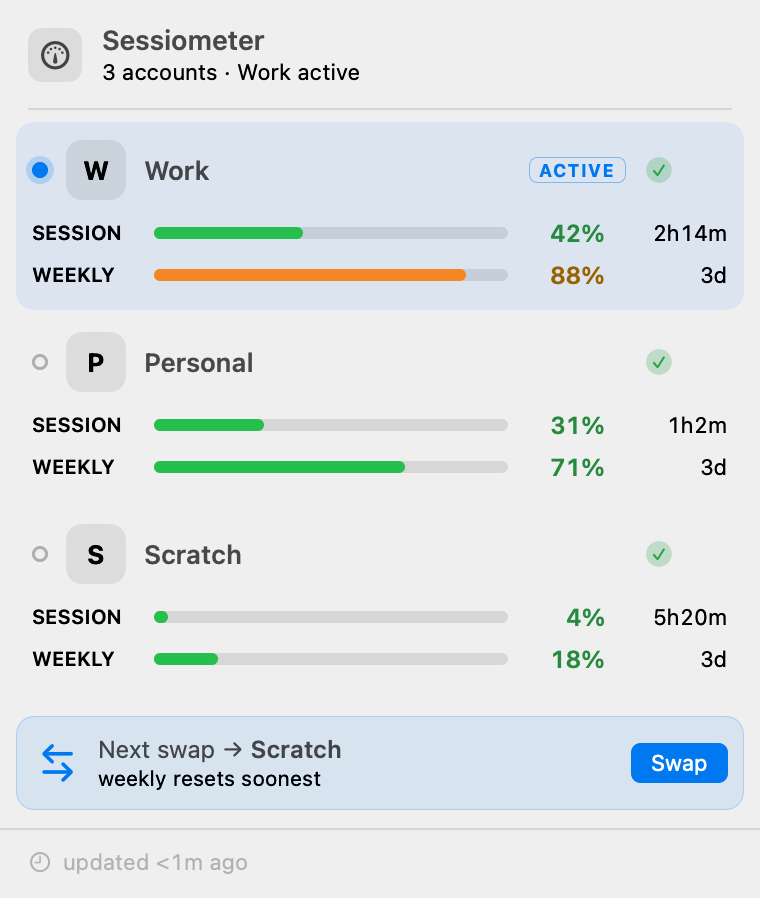
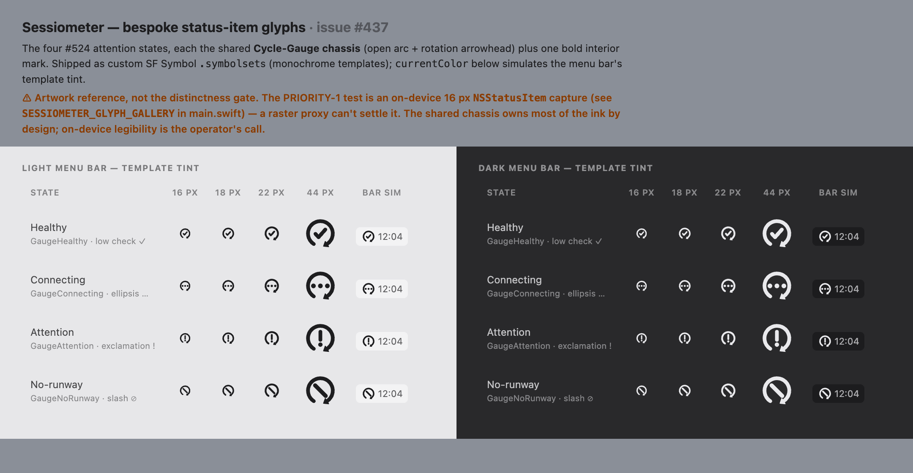

# Menubar design reference

The canonical **visual** build-reference for the SwiftUI menubar panel (see #168 / #169).
`menubar-preview.html` is a single self-contained mock of **all 9 launch-or-attach states**
(light + dark) in the intended native macOS language, plus a **capture-affordance interaction-states**
reference card (pending / done / error) for the in-app "Capture active account" action (#360), plus
the **pathological-content** group (#752) that is the oracle for hostile labels, percents and
durations — see *Pathological content* below — plus the **expiry** group (#957), the credential-foresight
line and its four verdicts, plus the **Settings window** group (#763), the one group that is not a panel
state at all; see *The Settings window* below.

**Before you build against a silence in this mock, read *What this reference does not author* below.**
The mock is the oracle *only for what it authors* — and that scoping is only usable if the gaps are
named, so that block classifies them. An unclassified silence is not authority to invent.


## Viewing it

- **Interactive / most faithful** — open the HTML in a browser: `open menubar-preview.html`
- **At a glance** — `renders/all-states.png` above, rendered from the HTML.

## Regenerating the render

The mock uses `backdrop-filter` vibrancy, which needs **GPU compositing**. Render with a
GPU-enabled headless Chrome — do **not** pass `--disable-gpu` (it forces software rendering and
blacks out the vibrancy). Run from this directory:

```sh
"/Applications/Google Chrome.app/Contents/MacOS/Google Chrome" \
  --headless=new --hide-scrollbars --force-device-scale-factor=1.0 \
  --window-size=1200,15700 --screenshot=renders/all-states.png \
  menubar-preview.html
```

(Bump the `--window-size` height if the page ever grows past it — but **not past the per-scale cap
below**. The committed render is 1200×15700 — at the `1.0` device scale the PNG's pixel height is
just this `--window-size` height, and a shorter one clips the notes. **Re-measured at #763**, which
added the four Settings frames: the document is **15698** CSS px and its deepest ink ends at
**15652**, the 46 px difference being `body`'s `padding-bottom`. So the capture keeps every painted
pixel with **~48 px** to spare and, unlike the #752 render, truncates nothing — the window is 2 px
taller than the document itself. **Only ~686 px of genuine bump room is left at this scale**, and
dropping the scale again is not the escape it was at #752: `1.0` is already the resolution floor
this render is willing to pay (last paragraph of this section) — so the next group that needs
frames should expect to trade: fewer frames, a shorter frame, or a second page.)

**Why the scale dropped `1.25` → `1.0` at #752** — the render height in *device* pixels (CSS height ×
scale) must stay under the GPU's 16384 px max texture dimension. Past it the GPU process dies
mid-render (`Restarting GPU process due to unrecoverable error`) and no PNG is written. #752's four
pathological-content bases took the mock from 34 frames / ~11050 CSS px to **42 frames / 14039 CSS
px**, and 14039 × 1.25 = 17549 device px is over the limit — so this is the documented case of
"growing the page eventually means lowering the scale, not just raising the height", not a
preference. At `1.0` the same page needs 14039 and fits. Measured empirically at #778 (at
`1.5`): 16350 device px renders, 17100 fails. #763's four Settings frames then took it to
**46 frames / 15698 CSS px** — they cost more per frame than a panel frame (two 460 px windows fit
the 932 px gallery only at a 12 px gutter, which is why `.settings-pair` overrides the gallery's own
40 px for exactly that span; and each window is 588 px tall including its title bar, so a Settings
row costs 662 px against a popover row's ~500), which is what spent most of the remaining room.

In the units of the knob you actually turn — the maximum `--window-size` height is **16384** at
`1.0`, **13107** at `1.25`, **10922** at `1.5` (16384 ÷ scale). Past that the bump *itself* kills
the render. Both `1.5` and `1.25` are now unreachable: their 10922 and 13107 caps are below the
mock's own 15698. The cost of the drop is resolution — the committed render is 1200 px wide where
it used to be 1500 — which is why the HTML, not this PNG, stays the faithful reference (*Viewing
it*, above).

If another Chrome is already running, add `--user-data-dir=<a scratch dir>` — without it the render
can block on the profile lock instead of exiting. Chrome also tends to write the screenshot and then
hang rather than exit, so run it under `timeout 180` and check the output file, not the exit code.

## Rendering the BUILT panel (design-parity check)

The mock is the reference; the **built** SwiftUI panel is what ships. To verify the panel actually
matches the mock — the check whose absence let the panel drift (#355) — render the real
`StatusPanelView` to PNG and diff it against the mock's **Healthy · Status** section.

The panel is an `NSPopover` view that can't be opened programmatically or screen-captured without
Screen-Recording permission, so a DEBUG-only tool (`RenderPanelTool`, wired in `AppDelegate`) draws
it straight to a bitmap with SwiftUI `ImageRenderer` — no popover, no screen capture, no TCC:

```sh
# from apps/menubar, after a Debug build (xcodegen generate && xcodebuild build -scheme Menubar …)
BIN=".build/xcode/Build/Products/Debug/Sessiometer.app/Contents/MacOS/Sessiometer"
"$BIN" --render-panel "$PWD/design/renders"
```

Output: `renders/panel-healthy-{light,dark}.png` — the built app (distinct from `all-states.png`,
which is the mock). These are safe to commit: `RenderPanelTool` pins a fixture roster (`Work` /
`Personal` / `Temp`), and the wire carries only the operator-chosen label, never an email (#15).
Light shown here:



**Expected reconciliations** — the built panel intentionally differs from the mock in these spots:

- **a `--render-panel` capture is NOT the live panel's layout** past the height budget (#818).
  `ImageRenderer` cannot rasterize a `ScrollView`'s content — measured against a working control, and not
  a clipping effect, since a viewport *taller* than its content renders just as blank — so
  `PanelRenderHarness` renders with the scroll boundaries bypassed. Every capture therefore shows each
  state's body at its full intrinsic height, where the live panel clamps at the budget and scrolls the
  excess. That is honest exactly while no state reaches the budget, which holds for every fixture at the
  default text size and is pinned per fixture by `testTheRenderBypassIsANoOpAtTheGoldenSizeClass`; the
  platform premise itself is pinned by `testImageRendererStillCannotDrawAScrollView`, which reddens the day
  the seam should be deleted. **A regression inside a scrolled body would not be visible to the golden
  gate** — tracked as **#1177**, which includes "accept the gap" among its routes
- no provider secondary line — the wire carries no `provider` field yet (#173)
- the Stats aggregate callout has a **second, mock-unauthored form**. When the daemon had no
  configured roster the census degraded to whoever held samples, and the panel says so by narrowing
  the subject — `All sampled accounts ≥95% at once …` rather than `All accounts …`, which in that
  regime the panel cannot establish (#866, the panel half of the CLI's own `, sampled accounts`
  qualifier from #836). Not that it *would be false*, which this row claimed until #1224: with no
  roster there is no set for "all" to have been measured against, and the sampled set is no subset
  of one either, since it admits an orphan handle the configured roster excludes (#314, #864). The
  mock draws only the configured form, so this is a state it does not author rather than
  one it disagrees with; the goldens likewise pin only the configured render. Drawing the frame is
  tracked on **#1037** (*the panel mock depicts only the happy path*) — as its own row, because the
  regime is an axis orthogonal to that issue's three *measurability* frames, and the two axes cross
- the same callout has **two further mock-unauthored forms**, on the MEASURABILITY axis (#1029). The
  census is meaningless without its denominator — with no instant at which the whole set was
  simultaneously observed there was nothing to count — so the panel now says
  `All accounts ≥95% at once — not measurable: never all in view at the same moment` instead of the
  `0 episodes (0s)` it used to print, which read as a calm week on a week the metric could see
  nothing. A partly-observed window annotates its measured share:
  `3 episodes (1h40m, all in view 64% of the window)`. The mock draws only the wholly-observed form,
  and the `--render-panel` `stats` fixture pins a FULL denominator to match it, so `build-comparison.py`
  never renders these two and the goldens pin neither. **Drawing them is exactly #1037's three
  measurability frames** — this row records the forms and the copy so the built panel can be read
  against the mock before those frames exist. The CLI diverges here deliberately and is not a bug:
  it renders its own `—` gap sentinel, shared with the `signal` / `velocity` / `runway` cells, which
  is R-2 STATE-parity — same state, per-medium vocabulary — not glyph-parity
- the footer reads "updated <1m ago" — the panel mirrors the `status` CLI (R-2 state-parity), not
  the mock's illustrative "snapshot 12s old". Resets no longer diverge: the mock now uses the CLI's
  compact duration form too ("2h14m" / "3d"), not a day-name (#387)
- the **Swap** button is LIVE as of #169 (it sends the displayed `next_swap` target over the daemon's
  `swap` command). Each non-active roster row is also a manual switch — as of #448 a **persistent, quiet
  trailing chip** (the neutral `SwapChipResting` asset token at rest since #956, brightening to
  `.secondary` when the row is armed on hover/focus), which the mock now specs (the resting chip on
  every switchable row); at rest the row
  keeps a trailing action slot for it, which is why the auth glyph sits ~37 pt further left than in the
  mock (the #448-widened 28 pt slot + its 9 pt spacing)
- ~~a **blocked** row carries its reason as persistent text where the mock delivered it hover-only~~ —
  **RECONCILED in #957, no longer a divergence.** A blocked row (weekly-exhausted / quarantined) carries
  its reason as **persistent text on its own line**, and the mock now draws exactly that (`.blockcue`, at
  the four blocked rows in the `blind-cornered` pair). *Why the panel does this, retained because it is
  what the mock is now agreeing WITH*: the row's spoken label (`rowSwitchAccessibilityLabel`) already
  stated the reason unconditionally, so hover-only made the spoken row strictly *more* actionable than
  the sighted one — the parity defect in the direction people check least; and whether a `.help` tooltip
  surfaces at all in the shipped panel's `panelIsKey` / `!appIsActive` presentation is still
  capture-pending (`docs/findings/0950-help-on-disabled-button.md`), so hover was never a safe sole
  channel. The tooltip and spoken label still keep the **remedy** sentence (`Run sessiometer poke to
  refresh it.`) that the resting line leaves off — the resting line carries the WHY only, because the
  full sentence overruns `rowCueBudget` at caption size. So nothing was moved off hover; it was added at
  rest, on both surfaces now. The cue is zero-chroma on both: the block is a fact about what the operator
  can DO, not a health verdict about the account
- ~~a **blocked** row carries no trailing chip where the mock draws a muted `nosign`~~ — **RECONCILED in
  #957, no longer a divergence.** A blocked row carries **no trailing chip at all** — an EMPTY but
  RESERVED slot, matching the active row's existing chip-free treatment — and the mock now draws that
  too (`.rowact.empty` at the same four rows; the `nosign` markup is gone). *Why the panel does this,
  retained because it is what the mock is now agreeing WITH*:
  measured on a live 1:1 capture the swap chip and its own negation are at ink-mass **parity** — 18.2
  over 70 px against `nosign`'s 19.5 over 82 px, the negation marginally the *quieter* of the two — in
  the same slot, at the same 11 pt, in the same emphasis token, both strokes horizontal along the row's
  dominant axis, drawing 1 px strokes at 1x entirely in the antialiasing regime. A reviewer could not
  tell the affordance from its negation without ~9× magnification. The empty slot resolves that
  maximally (actionable = a chip, blocked = no chip; no glyph is left to confuse) while adding no ring,
  capsule or container, not touching the leading-edge inset rule that carries fault severity
  (#485/#572), and *removing* an element rather than adding one that five of six rows would pay for.
  This is safe only because #955 landed first: the reason text above is now the blocked row's at-rest
  explanation, so the chip that went is a glyph nobody could read, not the explanation. The 28 pt slot
  stays **reserved** — the row does not reflow and the auth column stays aligned. Note the active row
  now shares this exact drawing for a *different* reason ("already here" vs "cannot go there"); the two
  are told apart by what each carries **positively** — the active row's filled dot + accent tint, the
  blocked row's persistent reason line — never by the shared blank slot
- the switch tooltip is scoped to the **whole row**, where the mock scopes it to the **chip**
  (`<span class="rowact" title="Switch to this account">`). This one is a **known defect, not a ratified
  divergence** (#953): the invitation sits on the row-wrapping `Button`, so hovering the health glyph
  answers with the *switch* copy. It is still open because the obvious fix is unverified — whether a
  `.help()` on a child inside that `Button` surfaces at all is **not established**
  (`docs/findings/0953-help-nesting-inside-a-row-button.md`), and if it does not, moving the copy to the
  chip deletes it rather than narrowing it, silently. The **health glyph** carrying no tooltip is by
  contrast a settled decision (#955/#957) that the mock **agrees** with — `title=` sits on `.rowact` 44
  times and on **zero** of the 86 `.health` spans — so do not "fix" that one either. Since #957 the mock
  also *states* that inertness rather than merely exhibiting it (the `.health` CSS comment gives the
  three reasons), so the agreement is now checkable rather than inferred from a count
- the third fixture account is `Temp`, where the mock illustrates `Scratch` — re-picked (#709) so all
  three healthy labels hash to **distinct** #445 identity slots (the mock's `Personal` and `Scratch`
  both land on slot 5 / ochre under the shared 8-slot `label` hash, so the built roster would otherwise
  render two of three rows in one colour). The committed oracle now demonstrates the per-account cue
  across three visibly-distinct colours — violet / ochre / teal — not two; the hues are hash-derived
  and, like every colour here, needn't match the mock's illustrative ones

(Capture placement is now reconciled with the mock, not a difference: the **populated** panel carries
no capture bar — capture is **empty-roster / first-run only**, and Add account lives off-panel in the
status-item right-click menu (#394). So `panel-healthy-*.png` correctly shows no capture bar.)

**Harness limitation — the capture field is NOT RASTERIZED by the tool (but it IS verified elsewhere,
#765).** SwiftUI `ImageRenderer` cannot rasterize the AppKit-backed `TextField` in the #360 capture
affordance (the operator-label input on the empty-roster / first-run onboarding card): it draws a blank
placeholder box, not the real field. So `--render-panel` faithfully captures every state's layout,
color, and typography **except** that one label field. Treat a blank/placeholder capture-field box in
the PNGs as a known tool artifact, not a panel defect.

What issue #765 changed is the sentence that used to follow. This note previously concluded that the
field therefore "needs a manual check against the mock in a real popover", and listed the #394 "Add
account…" surface as a second manual check. That conflated two different limitations: `ImageRenderer`
cannot RASTERIZE the field, which is still true, but rasterizing is one way to observe a view and not
the only one. `Tests/PanelCaptureCardTests` now verifies the card through two lanes that never need a
pixel, both inside the required `swift` CI job:

- **the accessibility tree** (#758's in-process walker) — the field's reachability, `AXTextField` role
  and enablement, at **every** capture phase: idle, in-flight, done, failed. Those phases are new
  coverage even against #758, which sees the one `empty-roster` render fixture at its resting phase. The
  disabled-while-pending state is a property a raster cannot express at all. Both entry points publish
  the same affordance and both are covered, so the #394 surface's *content* is no longer a manual check
  — its live-panel presentation still is (step 1 below).
- **CoreText metrics** (#750/#762 `TextMetrics`) — every shipped capture string measured against the
  card's derived text budget, across all 12 Dynamic Type classes.

What is still manual is the **live-panel interaction**: focus, keystroke routing, Return-to-submit and
Esc-to-cancel need a real `FloatingPanel` (the borderless non-activating `NSPanel` the status item hosts
— not an `NSPopover`, see issue #808), and the fidelity comparison against the mock's onboarding frames
is still a human eye. Those are steps 1–2 of the *Capture + notification pre-release checklist* below.

Two measured facts from building that gate, recorded because they are easy to re-lose:

- The button's **rendered** title ("Capture active account") never reaches the accessibility tree — its
  `.accessibilityLabel` ("Capture **the** active account") replaces it. A query keyed on the rendered
  string returns nothing and reads as "the button is absent". This is why every absence claim in that
  suite pins a known-present anchor first.
- The card's single-line strings use at most **43 %** of the card at every Dynamic Type class, so the
  "scaled font in an unscaled cell" mutation that falsifies `PanelTextMetricsTests`' sweep cannot trip
  that half of this one. Its falsifier is an over-wide fixture instead; the wrapping half keeps the
  scale mutation, where it trips decisively (2 lines → 4). Neither number is left to this paragraph:
  the sweep re-derives the worst ratio every run and reddens if copy growth closes the margin, and
  `testTheScaleMutationIsProvablyInertOnTheSingleLineLane` re-measures the mutated case (~92 % of an
  unscaled card) that makes the over-wide fixture the honest falsifier here.

**Harness limitation — the committed goldens capture only the RESTING frame.** `ImageRenderer` draws one
frame, and the fixtures render every model at rest, so the committed `panel-*.png` are resting frames by
construction. As of #448 the per-row manual-switch chip is PERSISTENT, so those renders do capture its
resting glyph (`arrow.left.arrow.right`) at its quiet resting emphasis, on every switchable row. Since
#959 a wire-BLOCKED row draws no chip, so on those rows the goldens show an EMPTY slot. Only
`panel-blind-cornered-{light,dark}` contain blocked rows, which is why a blocked-row presentation change
moves those two and no others.

They **record** that absence; they do not **gate** it, and the distinction is easy to lose. Removing both
blocked rows' chips scores `0.000502` against the drift gate's `0.002` ceiling — 4× *under* it, because
two 23×23 px regions in a 760×922 frame is a smaller change than a gate tuned to ignore antialiasing can
see — and the comparison is env-gated off in the required `swift` job anyway (see *Panel golden drift
gate* below). What actually holds the empty slot in place is the pure `switchChipEmphasis` verdict:
`.hidden` maps to `Color.clear` and reaches no tint case at all, and that verdict is unit-asserted.

**Corrected (issue #766): "not captured" was read as "not measurable", and that second claim is wrong.**
This note previously routed the ARMED brighten, the row wash and the in-flight `Switching…` spinner to a
manual operator check (#380) as though a static renderer could not reach them at all. What is actually
true is narrower: those states need an *input*, and the fixtures supply none. Given a seam that supplies
one — `AccountRowView`'s `armed` parameter, `AccountSwapModel.pendingPreview` — the same `ImageRenderer`
renders them fine, and `Tests/PanelInteractionStateTests` measures the difference every run. See
§ Interaction-state coverage for what that gate does and does not settle. Genuinely still manual, and
now listed rather than implied: the *pressed* wash, the `pointingHand` cursor (not a rendered property of
the view), the hover tooltip, and the real-popover swap round-trip.

**Correction (issue #749): `ImageRenderer` rasterizes headlessly.** This note previously said
regenerating the committed PNGs "needs a GUI / windowserver session — not something headless CI can
do", and that belief (echoed in `BarGlyphParityTests`) was the stated reason the panel had no automated
visual gate while the bar glyph did. It was never tested, and it is wrong:
`ImageRendererHeadlessProbeTests` rasterizes SwiftUI inside the standalone `MenubarTests` bundle
(`TEST_HOST: ""` — no host app, no `NSApplication`, no window) under `xcodebuild test`, across a bare
view, an SF Symbol, and the `@EnvironmentObject` / `@Published` environment-injection path that issue
#749 flagged as the likelier failure point. So an in-bundle panel golden gate IS reachable — and issue
#754 built it (see *Panel golden drift gate* below). (The stronger no-*windowserver* claim was confirmed
separately under `sandbox-exec` denying `com.apple.windowserver*` — `CGSession` nil, `NSScreen.count` 0,
identical output bytes — but only the in-bundle claim above is what CI re-runs.)

What stays a **manual pre-release step** is this `--render-panel` pass and the eyeball comparison it
feeds, for the ordinary reason that it needs a local Debug build of the app (`RenderPanelTool` is
`#if DEBUG`) and a human judging fidelity against the mock — not because of any headless limitation. The
automated half (drift against committed goldens) does run headless in CI, and it is a different question:
*has the panel changed?*, not *does the panel match the design?*

### Design vs. capture, screen by screen

`build-comparison.py` assembles a single self-contained page that puts the mock's **live** `.pop`
blocks next to the built-panel captures, state by state — the fastest way to eyeball parity across the
eight connection-states the panel implements, plus the active-account **blind** modifier (OK / DEGRADED,
#479/#485), the four **daemon-fault** ranks (#592), and the four **pathological-content** rosters
(#752/#753 — hostile labels, percents and durations; see § The stress fixtures). None of those last three
is a connection-state:
`blind` is a per-row modifier and a fault banner is resolved *over* a connected snapshot, which is why
both pair against a healthy green roster. The four fault ranks pair in the worst-first order the panel
resolves them (keychain-locked › scrub-exhausted › systemic › recovering), so a severity **inversion** —
a visual claim the format-layer unit tests cannot reach — shows up by reading them in sequence:

```sh
# from apps/menubar, after a Debug build
BIN=".build/xcode/Build/Products/Debug/Sessiometer.app/Contents/MacOS/Sessiometer"
"$BIN" --render-panel /tmp/panelcaps                         # render every state + the blind modifier, both themes
python3 design/build-comparison.py /tmp/panelcaps /tmp/design-vs-capture.html
open /tmp/design-vs-capture.html
```

**This harness re-baselines itself, by design — which is why the golden gate below exists.**
`build-comparison.py` slices the mock's `.pop` blocks **live** at comparison time, so editing
`menubar-preview.html` silently changes what the built panel is compared against. That is correct for
this tool (the mock is the reference; it *should* always read the current mock), but it means the tool
cannot detect PANEL drift — nothing here is committed, so nothing here shows in a diff. The panel
golden gate is the other half.

Frames are paired **by name**, never by position: every `.pop` block carries a `data-frame` (e.g.
`blind-ok-light`), and each `STATES` entry names the frame it pairs with. So add, remove, or reorder
frames freely — a mock frame and its Swift fixture no longer have to land in one commit (#581).

Name a new frame when you add it: kebab-case the `fcap` caption down to what distinguishes the frame —
state, then variant — and always suffix the theme (`Active blind · OK · Light` → `blind-ok-light`;
"Active" is filler, so it goes). That last step is judgment, not a transform, so match the neighbours —
nothing enforces the convention. What the script *does* enforce is presence and uniqueness: it exits
non-zero on an untagged block, a duplicate name, or a `STATES` entry pointing at a name the mock no
longer carries — naming the frame, or the line for an untagged block.

### Panel golden drift gate (#754)

The harness above is the **fidelity** path (a human eye, against the live mock). This is the **drift**
path: `Tests/PanelGoldenParityTests` re-renders every panel state in-process — SwiftUI `ImageRenderer`
inside the headless `MenubarTests` bundle, which issue #749 measured as viable — and diffs the fresh
renders against committed goldens under `renders/panel-goldens/`. **44 goldens** (22 fixtures × light/dark,
`panel-<state>-<theme>.png`, @2x), rendered through the same `PanelRenderHarness` the app's
`--render-panel` tool uses, so the automated gate and the human oracle can never render different states.

Read a green as "the panel's appearance has not changed since it was last blessed" — **never** as "the
panel matches the mock". The built panel intentionally differs from the mock on the axes listed under
*Expected reconciliations* above, and those differences are baked into the goldens.

**Regenerating (re-baselining) the goldens** — an explicit command, never a side effect:

```sh
# from apps/menubar
xcodegen generate
TEST_RUNNER_SESSIOMETER_PANEL_GOLDENS=update xcodebuild test \
  -project Menubar.xcodeproj -scheme Menubar -configuration Debug \
  -destination 'platform=macOS' CODE_SIGNING_ALLOWED=NO \
  -only-testing:MenubarTests/PanelGoldenParityTests/testRegenerateGoldensWhenExplicitlyRequested
```

The `TEST_RUNNER_` prefix is required: `xcodebuild` forwards only prefixed variables into the test
process (stripping the prefix). A bare `SESSIOMETER_PANEL_GOLDENS=update` reaches `xcodebuild` and not the
test, which then **skips** — writing nothing while exiting 0.

Then **look at the new renders** (a reference you have not looked at is not a reference) and record why
they changed:

```sh
git commit --trailer 'Panel-Goldens-Rebaselined: <what changed in the panel and why>'
```

`scripts/check-panel-golden-rebaseline.sh` enforces that trailer in CI on any PR touching
`renders/panel-goldens/**` — add, modify, or delete. Its falsifier peer
(`scripts/check-panel-golden-rebaseline.test.sh`) proves the guard goes red without it.

**Re-deriving the thresholds** (the measurement table in the suite's header):

```sh
TEST_RUNNER_SESSIOMETER_PANEL_MEASURE=1 xcodebuild test \
  -project Menubar.xcodeproj -scheme Menubar -configuration Debug \
  -destination 'platform=macOS' CODE_SIGNING_ALLOWED=NO \
  -only-testing:MenubarTests/PanelGoldenParityTests/testMeasureSeparations
```

Two of the header's rows are asserted by always-on tests rather than printed by that command (the
aqua-vs-darkAqua row, and the app-tool-vs-goldens row measured out of band by running `--render-panel`
into a scratch directory and `diff -rq`-ing it against `renders/panel-goldens/`), so re-deriving the
whole table means running the default suite too.

> **The `#824` cold-raster edge this recipe used to warn about is closed — the cause, not the symptom.**
> This block used to say: keep `-only-testing:` on that command, because `SESSIOMETER_PANEL_MEASURE=1`
> with the WHOLE `PanelGoldenParityTests` class reddens `testRendersSurviveTheClockDriftWindow` with
> `worst delta 1 over up to 19 bytes` — not a panel regression but the cold-raster exposure, since
> `testMeasureSeparations` adds a second full-catalog render pass and the warm-up covered only the
> `healthy` fixture, so a first-render cell could still carry ±1/255. Issue #824 removed that: every
> render is now settled against a transient depth the harness measures on the running machine, so a
> raster cannot reach a byte assertion un-settled.
>
> Two things are worth stating exactly, because they are different claims. The configuration above now
> passes (`17 tests, 3 skipped, 0 failures`, `worst delta 0 over up to 0 bytes`). But the `19 bytes` red
> did **not** reproduce on the parent commit when it was re-run to check — that same commit reports
> `worst delta 0` in this configuration today, so it is *not* the before/after evidence for #824. What was
> re-measured on the parent commit is the isolated invocation
> (`-only-testing:…/testRendersSurviveTheClockDriftWindow`): red at `882 bytes, worst delta 1` on 15 runs
> out of 15, against 38 of 40 green at `0 bytes` on the #824 commit. Which cells land inside the transient
> depends on how many renders precede them, so a whole-class figure is order-sensitive in a way the
> isolated one is not. Either way the answer was never a tolerance here.
>
> The 2 of those 40 that were not green failed for an unrelated, pre-existing reason with a distinguishable
> signature — a worst delta in the *hundreds* over ~450 bytes, a text change rather than the ±1/255 raster
> one. That was issue #1128, and it is closed: the lag ladder's top used to be 29 s against a 30 s
> `boundaryGuardSecs`, which reserved **nothing** for the test's own seed-to-raster latency, so any latency
> at all could carry a truncated seed over a `humanizeUntil` boundary. The top is now
> `boundaryGuardSecs - 1 - seedToRasterBudgetSecs` (24 s, reserving 5 s), the test measures its own latency
> and fails with that number when it exceeds the reserve, and the offsets the ladder no longer reaches are
> swept without a rasterizer by `testEveryClockRelativeFixtureInstantKeepsTheFullGuard`. **The signature
> guidance still stands and is still how a red here is read**: worst delta 1 over a few hundred bytes is
> cold-raster (#824); worst delta in the hundreds is a boundary crossing.
>
> Raising `boundaryGuardSecs` was the other candidate and it is the wrong lever — measured, not argued.
> The constant is spent in *both* directions on the same 60 s plateau: a countdown gets `G` seconds of
> post-seed margin and first crosses at `G + 1`, a `generatedAt` age first crosses at `60 - G` so its
> margin is `59 - G`. The window every fixture survives is therefore `min(G, 59 - G)`, maximised at
> `G = 29` and `G = 30` alike — a tie, both worth 29 s — and 30 is the one in use. Setting it to 45 makes
> the catalog sweep report a first crossing
> at **+15 s** instead of +30 — half the margin, on the `stale` / `disconnected` ages that are the observed
> failure. Both new gates redden with those numbers, so the lever answers for itself.

**What the relative gate does and does not cover.** The primary check —
`testEachFreshRenderIsNearestToItsOwnGolden` — asks that a fresh render's closest same-size golden be
itself, which needs no cross-machine calibration and catches one state morphing into another. It only has
power where a same-size golden of a *different* fixture exists to lose to, and goldens are sized by
content: 8 of the 22 fixtures (`stats`, `disconnected`, `not-running`, `empty-roster`, `blind-cornered`,
`starting`, `crash-looping`, `expiry`) own a unique height, so their size group holds only their own two
themes, ~0.97 apart. For those **16 of 44 cells the relative check is trivially satisfied** and the absolute
ceiling — the cross-machine *unvalidated* half — is the only thing defending them. The suite asserts that
count rather than merely noting it, and prints it on every run alongside the weakest real margin (measured
**0.002513**), so the promotion decision in issue #790 has the number in front of it.

> Issue #753 moved the DENOMINATOR without moving the number, and that is the good direction: all four
> stress fixtures landed in size groups that already held another fixture (the three 4-row rosters share
> 760x1090; `wire-hostile-numerics` is 3-row and joins `healthy` / `stale` at 760x898), so every one of the
> eight new cells has a cross-state rival. Uncovered went **16-of-36 (44 %) → 16-of-44 (36 %)**, and the
> distinctness check's subject grew 38 → 62 same-size pairs. Read the unchanged 16 as coverage *gained*,
> not as nothing having happened.

> That count **regressed from 10 to 14 at issue #776**, and the promotion decision should read it as a
> cost, not a detail. `View log` made `starting` and `crash-looping` taller by *different* amounts — the
> mock styles the action `.btn.link` in one and `.btn` in the other — so the 8-cell size group those two
> shared with `connecting` / `unsupported` split into a 4-cell group plus two singleton pairs. Four more
> cells now rest on the absolute ceiling alone, and the distinctness check's subject fell from 57 same-size
> pairs to 37. Nothing about the panel got less correct; the *relative* gate simply has less to compare.

**What runs where.** Only the two committed-golden comparisons are cross-machine sensitive (goldens
rasterized on one machine, re-rendered on an unpinned `macos-latest`), so they are env-gated off by
default and run only in the **non-required** `panel-goldens` CI job:

| Assertion class | Where | Required? |
|---|---|---|
| renders succeed · non-blank · deterministic · clock-drift window · host-appearance independent · pairwise distinct · health-tint assets resolve · both canaries · PNG round-trip | `swift` job (default suite) | **yes** — all same-run comparisons, cross-machine immune |
| `testEveryRenderMatchesItsCommittedGolden` · `testEachFreshRenderIsNearestToItsOwnGolden` | `panel-goldens` job (`SESSIOMETER_PANEL_GOLDEN_GATE=1`) | **no** — soft-landing |
| `Panel-Goldens-Rebaselined:` trailer | `gate-change-ack` job | **yes** — pure git, cannot be flaky |

**A golden can change bytes without changing pixels.** The gate compares decoded PIXELS, never file
bytes — which is why the suite normalizes both sides into one sRGB/RGBA8 buffer. `NSBitmapImageRep`'s PNG
encoder is byte-stable for a given OS + Xcode but not across versions, so re-blessing on a newer machine
can produce a diff with no visible change. Measured instance: the committed `renders/panel-healthy-*.png`
oracle, back when it had been rendered on an older toolchain, differed in bytes from a fresh render at
**0.000000** pixel drift. Do not read "the PNG changed" as "the panel changed"; the gate's own verdict is
the answer.

**On THIS toolchain the goldens are byte-reproducible, and that is deliberate.** Two independent
`SESSIOMETER_PANEL_GOLDENS=update` runs produce byte-identical files, and the app's own `--render-panel`
output is byte-identical to all 44 goldens. Six of them stopped matching when #824 landed: blessed from
cold rasters, they held pixels a settled render no longer produces, so the *goldens* were the stale side.
Nothing failed (the drift metric is blind to ±1), so issue #1129 re-blessed those six on a commit of
their own rather than let the next real design change carry them — they moved by at most 1/255, on
antialiased edges only, with alpha, dimensions and every panel state unchanged. It did not start out
that way: the first renders in a process
disagree with the steady state by ±1/255 on ~0.03 % of bytes — the rasterizer's start-up transient, found
by rendering one fixture six times (renders 0–1 agree with each other, renders 2–5 agree with each other,
the two groups differ) and ruled out as a clock effect because renders seeded seconds apart are
byte-identical. `PanelRenderHarness.render` now settles EVERY render it serves: it measures how long this
machine's transient plateau runs, then hands back only a raster whose agreeing run is longer than that
(issue #824 — the earlier "discard until two consecutive agree" rule could not see past a transient whose
own rasters agree with each other, and warmed one fixture besides). So both the app tool and the in-bundle
gate rasterize from the steady state whatever order they render in. None of this changes a VERDICT — the
gate metric ignores channel deltas under 64/255 either way — it protects the AUDIT TRAIL: without it a
re-bless rewrites files that did not change, and the real change hides among the churn in exactly the
diff `Panel-Goldens-Rebaselined:` exists to make readable. `PanelGoldenParityTests` asserts the
byte-exactness directly, so a regression here fails loudly rather than quietly returning the churn.

**Promotion to required: N = 10 consecutive green `panel-goldens` runs on `main`.** Ten rather than three
because the risk under measurement is antialiasing drift on an *unpinned* runner image, and the sample
must span at least one image roll. EVERY step in the job is `continue-on-error` — not just the gate step,
because `ci-ok` fails on any un-guarded step in a job it needs, so a `brew install xcodegen` network blip
would otherwise block a merge through the very job whose whole point is not to. The job's conclusion is always
success; the countable signal is the `PANEL_GOLDEN_GATE_RESULT=green|red` line the reporting step prints,
alongside the `max drift` figure the promotion decision needs. **The promotion decision — the tally, the
re-calibration question it must answer first, and the mechanics — is recorded in issue #790.**

## Accessibility (#758)

Accessibility *labels* have long been deliberate and unit-tested as **strings**
(`StatusPanelFormatTests`). What issue #758 added is a gate over everything about a11y that is **not** a
string — reachability, role, enabled state, element order, and whether `accessibilityHidden(true)`
decorations genuinely *leave* the tree. A correct label on an unreachable or mis-typed element is not
accessible.

### The tooling question, answered

Issue #758 was written around "`performAccessibilityAudit` needs a macOS 14 host, but the app targets
13.0 — can we audit at all?" Measured 2026-07-28, that framing names the wrong blocker three times:

1. **The host was never it.** Dev machine macOS 26.5.2 / Xcode 26.6; CI's `macos-latest` resolved to
   macOS 26.4 on the #749 and #761 runs.
2. **The test bundle can outrank the app.** Adding `deploymentTarget: "14.0"` to the `MenubarTests`
   target yields `MACOSX_DEPLOYMENT_TARGET = 14.0` for it while the `Menubar` app target still reads
   `13.0` — XcodeGen's per-target key overrides `options.deploymentTarget` for that target only. So the
   app's shipping floor never had to move.
3. **…and it is not needed.** `performAccessibilityAudit` hangs off `XCUIApplication`, i.e. a UI-test
   bundle, with all of issue #761's costs (own scheme, dead on a locked session, prose-coupled queries).
   The accessibility tree turns out to be reachable **in-process** from the existing headless bundle.

So the automated branch is a **GO**, by a cheaper route than the issue anticipated, and `project.yml`'s
`macOS: "13.0"` is untouched.

### The automated gate

`Tests/PanelAccessibilityTreeTests` hosts the panel in an `NSHostingView` and walks the live AppKit
accessibility tree across all 18 render fixtures — no XCUITest, no scheme risk, no TCC grant
(`AXIsProcessTrusted()` is **false** in that bundle), ~0.6 s, inside the required `swift` job. It asserts
interactive elements publish `AXButton`, blocked rows publish `enabled=false`, decorative elements are
**absent** from the tree, no focusable element is silent, navigation order runs header → tabs → roster →
footer, and each fixture's role histogram is unchanged.

Two constraints make its green trustworthy, both learned the hard way locally:

- **Every absence claim pins a known-present anchor in the same dump.** An empty tree satisfies "nothing
  leaked" perfectly, so absence is evidence only against a populated tree — the trap issue #761's spike
  fell into when it read a filtered tree as a complete one.
- **Every predicate has a mutation canary.** Each is fed a deliberately-broken view through the *same*
  function the real assertion calls, because a gate authored against passing code can be one that cannot
  fail — issue #437's three render bugs are the local precedent for what that costs.

Two known defects are pinned as set **equality**, so fixing either turns the suite red and says so:
issue #838 (a decorative Stats icon reaching the tree) and issue #839 (non-interactive rows publishing
`AXUnknown`). The Settings window is **not** covered — see issue #840.

### Appearance variants: increased contrast, reduce transparency, reduce motion (#760)

Issue #760 asked for render fixtures under the three system accessibility *display* settings, each
asserted to **differ** from its baseline on the reasoning that an identical render means the setting is
being ignored. The reasoning is right; the premise underneath it is not. Measured 2026-07-28, **none of
the three can be driven from a test process**, so no such fixture exists and none was faked.

| Axis | Reachable in-bundle? | Evidence |
|---|---|---|
| Increased contrast | **No** | `\.colorSchemeContrast` is get-only; and `NSAppearance` — the only other lever — does not reach an `ImageRenderer` render for *any* appearance (see blocker 2) |
| Reduce transparency | **No**, doubly | `\.accessibilityReduceTransparency` is get-only — *and* the renderer reports `false` even where the system says `true` (measured on CI), so changing the system would not reach it either |
| Reduce motion | **No**, and never fixture-shaped | Same get-only key, same defaults-regardless-of-system behaviour — *and* a still raster encodes no motion at all, so no golden-style gate can ever cover it |

Two independent blockers, either of which alone would be decisive:

1. **All four accessibility environment keys are get-only** on `EnvironmentValues` —
   `colorSchemeContrast`, `accessibilityReduceTransparency`, `accessibilityReduceMotion`,
   `accessibilityDifferentiateWithoutColor`. `.environment(\.accessibilityReduceTransparency, true)` is a
   **compile error**, not a runtime no-op. `\.colorScheme` *is* writable, which is exactly why the
   light/dark axis issue #749 unblocked works and these do not — they are not the same mechanism, and the
   assumption that they were is what #760 was scoped on.

   The unreachability is **double**, and only CI could show it. The GitHub runner has Reduce Transparency
   and Reduce Motion **ON**; an `ImageRenderer` render there still reports `false` for both. So the
   renderer does not inherit the system setting either — changing the system would not reach it even if a
   test could. (An earlier draft asserted the render *tracks* the system; that passes on any machine with
   the settings off, including the authoring one, and CI falsified it. Useful side effect: this is why the
   committed panel goldens are portable across machines with different accessibility settings.)
2. **`NSAppearance` does not reach an `ImageRenderer` render** — and the precise shape of this matters,
   because the obvious reading of it is wrong. `performAsCurrentDrawingAppearance` **is** live in this
   process: it changes an AppKit colour resolution (`NSColor.textColor` → near-black under `.aqua`,
   near-white under `.darkAqua`). It just never reaches the SwiftUI renderer, for *any* appearance — even
   `.aqua` vs `.darkAqua` at a pinned `\.colorScheme` renders byte-identically. So the high-contrast null
   is **not** a fact about the high-contrast names; it is the general fact, and it would look identical
   even if the high-contrast assets resolved perfectly.

   **Do not read these as the same measurement as issue #832's.** #832's pin resolves colours through the
   AppKit path, where the lever *is* live, so its zero is a genuine finding about asset lookup honouring
   the name. These pins use a path where the lever is dead. The two do **not** move together: if AppKit
   ever starts honouring the high-contrast name, #832's pin reddens and these stay green.

`Tests/PanelAppearanceVariantTests` pins all of that, so it reddens the day a macOS or SwiftUI revision
changes it rather than decaying into an unchecked assumption. A sameness-pin needs *two* things proven
before it is evidence — that the comparison can see a difference, and that the **lever** being driven is
live — because a lever that does nothing yields a passing measurement about nothing. Both are pinned, the
second by an explicit liveness control. Verified by mutation, not inspection: feeding the contrast pin a
genuinely different raster reddens it at 2 042 964 bytes / worst channel 217.

**What is covered instead, for reduce transparency.** The panel is heavily backdrop-dependent — its
`.regularMaterial` scrim composites what is behind it *inside* the SwiftUI pass, so the same panel over
different opaque backdrops rasterizes differently (healthy/light, 760×898 @2×):

```
over white .......... 0.000000 vs bare      over 0.1 white ...... 0.909323
over 0.9 white ...... 0.000000              over black .......... 0.933727  (worst channel 90)
over 0.5 gray ....... 0.000000              over rgb(.9,.2,.6) .. 0.929223
```

The light rows read 0.000000 because `.regularMaterial` in the light scheme resolves near-white, landing
within the metric's 64/255 channel threshold of its own unbacked fallback — not because nothing happened.
Worth stating plainly: the bare render is **100 % opaque** at the alpha level (682 480/682 480 px at alpha
255, zero partial), so "the panel is opaque" and "the panel is backdrop-dependent" are both true and not
in tension — the blending happens before the raster gets its alpha.

That establishes the axis is **consequential** (removing vibrancy moves most of the frame), so it must not
be closed as "no visible effect".

**AC-3 is not starting from zero.** `StatusPanelFormatTests` (#759) already measures every panel text tint
at 4.5:1 and every glyph tint at 3:1 against an **opaque** popover base — `lightBase = RGB(247, 247, 250)`
/ `darkBase = RGB(38, 38, 43)`, described there as the agreed stand-in precisely because "the live panel
floats on vibrancy, which is not headlessly measurable". That opaque-base sweep **is** the token-level half
of "does not go opaque-on-opaque", and it is already gated. What is missing is the **panel-level** half:
whether the composed surface still reads once the material stops contributing.

That half deliberately stops short of a legibility *threshold*: the mock defines the default appearance
only, so what the panel should look like once the OS removes vibrancy is an **unratified design question**,
and a threshold here would settle it by assertion. Routed to issue #868 with the product gap below.

**The product gap.** The panel's own code consults none of the three settings — a grep over `Sources/`
for the environment keys and `NSWorkspace.accessibilityDisplayShould*` returns nothing. Note what that
does and does not establish: the panel's translucency comes from **framework-provided** surfaces
(`.regularMaterial` in `StatusPanelView`, and the host `NSVisualEffectView` with `material = .popover` in
`StatusItemController`), whose Reduce-Transparency response lives in AppKit/SwiftUI rather than in app
code. So the OS very likely *does* change the panel under these settings — the measurement above says such
a change would be large — while nothing in the panel *deliberately* responds to it, and nobody has looked
at the result. Honouring them intentionally is product work needing a ratified visual target, tracked as
issue #868; the contrast half stays with issue #832.

### Appearance-settings pre-release checklist (manual)

> This is one of **six** manual pre-release checklists, each owning a disjoint surface — see
> § The manual checklists, indexed for the full set and what each covers.

The three axes above have no automated coverage and cannot get any, so they are checked by hand. Toggle
each in **System Settings → Accessibility → Display**, then open the panel:

Nothing in the panel *deliberately* responds to any of these (issue #868), so the expected outcome is
"whatever AppKit/SwiftUI does on our behalf". **Record what you see — that observation is issue #868's
evidence, not a new defect to file.**

- [ ] **Increase contrast** on — walk `healthy`, `blind-degraded`, `blind-cornered`, `fault-keychain-locked`
      and `empty-roster`. Borders and separators should strengthen; every meter, health glyph and percent
      stays readable; nothing turns into a flat block. Compare each against the same state with it off.
- [ ] **Reduce transparency** on — the popover goes opaque. Confirm no chrome *vanishes* (a border, strip
      tint or leading rule that was carrying vibrancy) and nothing lands opaque-on-opaque (a label matching
      its own field). Check over both a light and a dark desktop wallpaper — the measurement above shows the
      panel's appearance depends heavily on what is behind it.
- [ ] **Reduce motion** on — the panel has **four** in-flight spinners and nothing automated covers any of
      them. Trigger each: the per-row **switch chip** (click a non-active row), the **Swap** button, the
      **Start daemon** button (with the daemon stopped), and **Capture active account** (empty-roster/
      first-run card). None should whirl or bounce; a static or cross-fade indicator is correct.
- [ ] Repeat the first two in **both** Light and Dark mode — the colour sets ship separate
      high-contrast variants per scheme (issue #832), and nothing automated reads them.

### VoiceOver pre-release checklist (manual)

The tree walk cannot see VoiceOver's own behaviour: the rotor, real focus traversal, and speech are
runtime features of the screen reader, not attributes of the tree. Those stay manual. Run this before a
release, with VoiceOver on (`⌘F5`):

**Status panel** — open it from the menu bar, then:

- [ ] `VO`+arrow traverses header → Status tab → Stats tab → each roster row → next-swap callout → switch
      chip → footer, with nothing skipped and nothing announced twice.
- [ ] Each roster row speaks its whole sentence (label, active/auth state, both percents and resets).
- [ ] The switch chip announces as a **button**, not as text, and speaks its target account.
- [ ] On the `blind-cornered`-shaped state, a weekly-exhausted row announces as **dimmed / unavailable**,
      not merely with "Can't switch" buried in its sentence.
- [ ] No glyph, meter, sparkline, capsule or signal pill is ever focused — VoiceOver should never say
      "image" inside the panel. (Issue #838 is a known live exception in the Stats tab until fixed.)
- [ ] Rotor (`VO`+U): the roster is navigable by control type; note which rows are missing from the
      button/text lists (this is the observation issue #839 is tracking — confirm or correct it here).
- [ ] Switching Status ↔ Stats moves focus somewhere sensible rather than dumping it at the panel root.

**Cold-state message cards** — the panel states that replace the roster with a message plus an action.
Every item above walks the *healthy* panel, so nothing here was covered until now; these cards are where
the panel's only other controls live (`Start daemon`, #170; `View log`, #776).

- [ ] With the daemon stopped (`not-running`) and again while it is coming up (`starting`), `VO`+arrow
      reaches the card's action and announces it as a **button** with its own name — not as text, and not
      skipped on the way from the header to the footer.
- [ ] `View log` is reachable and activatable by **keyboard alone** (`Tab` to it, `Space` to press) in both
      the `starting` and `crash-looping` cards, and pressing it brings Console.app forward.
- [ ] Where there is no log to open, `View log` is genuinely **absent** rather than present-and-silent —
      VoiceOver should find no button to announce (issue #169's honest-affordance rule; delete the log at
      `~/Library/Logs/sessiometer/sessiometer.log` to check).

**Settings window** — `⌘,`:

- [ ] The window announces its title and is fully reachable by `Tab` and by `VO`+arrow.
- [ ] Every `Toggle`, `TextField` and `Button` announces its role and current value.
- [ ] The per-field help text is spoken (it maps to `accessibilityHelp`).
- [ ] The decorative icon in the load-failure state is never focused.

Not on this list on purpose: the **armed / hover** states. Hovering drives only the row wash, the chip
tint step and the cursor — none of which is an accessibility attribute, so an armed row and a resting row
are byte-identical in the tree and VoiceOver cannot distinguish them either. That surface belongs to
issue #766's interaction-state checklist, not here.

### Settings window pre-release checklist (manual, non-VoiceOver)

Issue #762 put the Settings window's copy and its two hardcoded field widths under an automated gate
(`Tests/SettingsTextMetricsTests`). Three surfaces stayed out of reach of that gate — window/activation
lifecycle, the `⌘S` key event, and runtime affordances (spinner, focus ring, hover tooltip) — and they
are listed here rather than left silent, since the issue's AC-4 is explicit that an untestable surface
must be named as such. They expand to the seven steps below because two of them have a stopped-daemon and
a running-daemon half, and because issues #844 and #944 added a second runtime affordance — the footer's
clamped apply-status label, one step per arm since the two have different triggers — whose drawing no
headless bundle can observe. Everything else the gate could not reach has a tracked owner instead: the
accessibility tree is issue #840, the design reference is § The Settings window below (issue #763,
landed), and Dynamic Type is the
pinned defect issue #845.

Run these with the daemon RUNNING (so the form loads) unless a step says otherwise:

- [ ] **Window lifecycle.** Open Settings (`⌘,`), close it, reopen it. The window reappears with the same
      size and position, exactly one Settings window ever exists, and each open re-reads the daemon (edit a
      tunable in `config.toml` externally, reopen, confirm the form shows the new value).
- [ ] **Activation policy.** While Settings is open the app has a Dock icon and is `⌘`-Tab reachable; after
      closing it the Dock icon goes away again. A lingering Dock icon means the app is stranded in
      `.regular` — the failure `SettingsWindowController` deliberately avoids by omitting `.miniaturizable`.
- [ ] **⌘S.** With a pending edit, `⌘S` saves without touching the Save button. With no pending edit — and
      while a save is in flight — it does nothing. (The predicate behind the button is gated automatically;
      that the *key event* reaches it is not.)
- [ ] **Loading + focus.** With the daemon STOPPED, open Settings: the Notifications and General sections
      are still usable, and the daemon section shows the honest failure rather than a blank or fabricated
      form. Tab through the form and confirm every field shows a visible focus ring and the spinner
      animates on a slow first load.
- [ ] **Hover tooltips.** Hover each tunable field and confirm its `.help` text appears. This is the only
      place a field's unit and meaning are explained, and hover is not an accessibility attribute — no
      tree walk can see it. (VoiceOver users get the same copy via `accessibilityHelp`, which the
      VoiceOver checklist above covers; this bullet is the sighted-mouse half.)
- [ ] **The footer's clamped failure label** (issue #844). Save a tunable from an app older than the
      daemon — or edit `SettingsFormat.applyFailureText`'s `.daemonError` arm to interpolate a few
      hundred characters — and confirm the red footer line stops at **two** lines with a trailing
      ellipsis, that the form above it does not move, and that hovering it shows the message in full.
      The clamp CONSTANT, that the string overruns it, and that `.help` publishes the whole message to
      the accessibility tree are all gated in `SettingsTextMetricsTests`; that SwiftUI actually draws
      two lines and not ten is the half only an eye can settle, and the window is not resizable, so an
      unbounded label eats the form rather than clipping.
- [ ] **The footer's clamped rejection label** (issue #944). Its own step rather than a note on the one
      above, because the trigger is different and far cheaper: set `target_max_session_usage` to **0**
      and save. No version skew, no source edit — the daemon rejects it with a 169-character
      cross-field remedy (`src/config/validate.rs`, the issue #414 trap), and on the `invalid` path
      that message *is* the label rather than a detail appended to an app sentence. Confirm the red
      footer line stops at **two** lines, that the form above it does not move, and that hovering shows
      the remedy in full — the tooltip is the only place the operator can read the fix. Then check a
      reason that carries no detail (edit a label for a removed account): the tooltip must still show
      that arm's sentence rather than nothing, which is what `.help(detail ?? "")` used to do. Finally
      malform `config.toml` by hand and save: the label says only that the file couldn't be read, and
      the tooltip must add the daemon's parse error under it — that error names the line and column,
      and this tooltip is the only surface carrying it.

Not on this list on purpose: the per-field COPY, the Save enable/disable rule, and whether a value or
label fits its field. Those are measured in `SettingsTextMetricsTests` and do not need a human.

### Status item + app entry pre-release checklist (manual)

Issue #764 put the status item's and the app entry point's pure DECISIONS under automated gates
(`Tests/StatusItemChromeTests`, `Tests/AppLaunchPlanTests`). What is left is the imperative shell those
decisions drive — `NSStatusBar`, `NSPanel`, the global event monitor, and the top-level `NSApplication`
bootstrap — none of which a headless logic bundle can stand up. `StatusItemController.swift` and
`main.swift` therefore remain excluded from `MenubarTests` and always will be: the controller owns real
menu-bar chrome, and `main.swift` is top-level entry code that cannot live in a unit-test bundle at all.

Here is where every surface of those two files went. **25 rows: 9 covered by this item, 6 already covered
elsewhere (one of those with an OS-wiring half that only a human can see, so it also appears below), 8
routed to the 8-step manual checklist below, and 2 filed as defects.** Nothing is left silent.

| Surface | Disposition |
|---|---|
| Panel placement (centering, both-axis clamp, #446 bottom floor) | `StatusItemChromeTests` |
| Degenerate `fittingSize` fallback | `StatusItemChromeTests` |
| Primary vs secondary click classification | `StatusItemChromeTests` |
| Lifecycle-menu rows, order, copy, shortcuts | `StatusItemChromeTests` |
| Outside-click disposition (own-icon, in-flight retain) | `StatusItemChromeTests` |
| Open-panel precondition | `StatusItemChromeTests` |
| Launch-mode dispatch + precedence + gallery opt-in | `AppLaunchPlanTests` |
| Degrade wording + per-call-site timeout budgets | `AppLaunchPlanTests` |
| Degrade FEED shape (exactly one `.disconnected`, then finish) | `AppLaunchPlanTests` |
| `ConnectionState` → glyph projection | Already: `HonestStateMachineTests` (exhaustive 10-row table) |
| One distinct silhouette per state (the brand lock) | Already: `StatusGaugeTests` + `BarGlyphParityTests` |
| First-launch login-item registration, `canStartDaemon` | Already: `LoginItemModelTests` (#170) |
| Daemon-agent re-registration after an app update | Already: `LoginItemModelTests` (#788) |
| Sleep/wake dwell suspension logic | Already: `WatchStatusStoreTests` (#526) — the OS wiring is step 6 below |
| Socket-path resolution + its failure taxonomy | Already: `SocketPathResolverTests` (ADR-0011 tripwire) |
| Status-item creation, button target/action, panel + vibrancy chrome | Manual, step 1 |
| Panel show/hide, key focus, `FloatingPanel.canBecomeKey` | Manual, steps 2 + 8 |
| Transient-menu presentation mechanism | Manual, step 3 |
| Global outside-click monitor install/remove | Manual, step 2 |
| Stats re-size observer (`objectWillChange` → re-fit while open, #446) | Manual, step 4 |
| `start()` presentation-stream consumption + its idempotence guard | Manual, step 1 |
| Activation policy (`.accessory`), `applicationWillTerminate` | Manual, step 7 |
| Notifier-before-`store.start` ordering | Manual, step 5 |
| Tool flag with no output directory falls through to a normal launch | Filed: issue #850 |
| Control-client `.failure → nil` degrade mapping (×4 call sites) | Filed: issue #853 |

Two rows deserve their reasoning stated, because both were originally mis-filed here and the correction
is the useful part. The **socket-path** row covers `resolve()` returning the right `ResolveError` — NOT
what the four call sites do with it; that `.failure → nil` branch is a genuinely uncovered honesty path
(issue #853), and the obvious manual step does not reach it, because a merely *stopped* daemon still
resolves its socket path and the client is constructed and then times out. And the **state → glyph** row
is this item's entire answer to AC-1, so `StatusItemChromeTests.testTheUpstreamStateToGlyphTableStill`
`Exists` reads that suite's source and reddens if the table is deleted or narrowed — a link, not a note.

Run these against a real build with the daemon RUNNING unless a step says otherwise:

- [ ] **The item appears, and tracks state.** Launch the app: exactly one status item appears, showing a
      monochrome gauge that tints correctly in a light AND a dark menu bar. Stop the daemon and confirm the
      glyph changes, then restart it and confirm the glyph follows — the item must keep tracking, and must
      never end up with two subscriptions double-applying. (Which glyph each state selects is gated
      automatically; that the item exists at all, that the image is applied as a template, and that the
      presentation stream is consumed exactly once, are not.)
- [ ] **Click to toggle, and click away.** Primary-click the icon: the panel opens below it with a visible
      gap, and the icon stays visible and clickable. Primary-click the icon again: it closes. Open it, then
      click elsewhere on screen: it closes. Start a swap and click away mid-flight: it must NOT close.
      (The decision is gated; that the global monitor is actually installed and removed is not.)
- [ ] **Secondary-click menu.** Right-click and control-click the icon: the lifecycle menu appears
      positioned under the item, and the panel closes first if it was open. Pick each row and confirm it
      acts. Then primary-click the icon: the panel must still toggle — a menu left permanently assigned to
      the status item would hijack the primary click (#325/#326).
- [ ] **Stats tab re-size.** With the panel open on Status, switch to Stats: the panel must GROW to fit
      the taller content rather than clipping it, and must stay fully on screen. Switch back to Status: it
      must shrink to the original size. Then close the panel, switch nothing, and reopen — it opens on
      Status at the small size. (The arithmetic is gated automatically; that the observer fires and defers
      the re-fit to the next run-loop turn is only observable here — #446.)
- [ ] **Cold start with the daemon stopped.** Launch with no daemon: the item shows the disconnected
      glyph, the panel opens and reads honestly, and no notification is missed on the first snapshot when
      the daemon comes up (the notifier is installed BEFORE the store starts consuming — an ordering the
      wiring, not a model, guarantees).
- [ ] **Sleep/wake.** Close the lid overnight (or `pmset sleepnow`) with the daemon running, and check the
      item on wake: a benign long disconnect must NOT have escalated to Attention. The dwell logic itself
      is unit-tested; that the `NSWorkspace` notifications reach it is only observable here (#526).
- [ ] **Agent shape.** Confirm no Dock icon and no app-switcher entry while only the status item is up,
      and that Quit terminates the app while `sessiometer status` still answers — Quit is a pure-client
      control and must never stop the daemon.
- [ ] **VoiceOver on the item.** With VoiceOver on, navigate to the status item and confirm it speaks the
      current state sentence, and that focus moves INTO the panel when it opens. (`FloatingPanel` overrides
      `canBecomeKey` precisely so this works; a plain borderless window would leave the panel unreachable.)

Not on this list on purpose: the panel's own contents. Those are covered by the panel golden gate, the
accessibility-tree gate (#758) and the VoiceOver checklist above.

### Capture + notification pre-release checklist (manual)

Issue #765 put the two surfaces the render harness structurally cannot see under automated gates —
`Tests/PanelCaptureCardTests` for the capture card (see the *Harness limitation* note above for what each
lane proves) and `Tests/NotificationDeliveryTests` for delivered notification content. What is left is
the part that is genuinely not a decision: a live `NSPanel`'s focus and key routing, and
`UNUserNotificationCenter`'s own prompting and rendering. Neither is observable from a headless bundle at
any effort, so they are listed here rather than left silent.

Here is where every surface of those two went. **13 rows: 8 covered by this item, 1 already covered
elsewhere, 4 routed to the checklist below.** Nothing is left silent.

| Surface | Disposition |
|---|---|
| Capture field reachable, `AXTextField`, enabled at rest | `PanelCaptureCardTests` (tree lane) |
| Field + button DISABLED while a capture is in flight | `PanelCaptureCardTests` (tree lane) |
| Done / failed status copy reaches the tree | `PanelCaptureCardTests` (tree lane) |
| Both entry points (#360 onboarding, #394 Add account) publish the same affordance | `PanelCaptureCardTests` (tree lane) |
| Card tree SHAPE (no decorative leak into the card) | `PanelCaptureCardTests` (tree lane) |
| Every capture string fits / wraps within the card, at every Dynamic Type class | `PanelCaptureCardTests` (metrics lane) |
| Delivered notification content carries no account label or email | `NotificationDeliveryTests` (end-to-end, past the seam) |
| Delivery identity is fresh per post (no coalescing) + the app-level grouping decision | `NotificationDeliveryTests` |
| Swap / exhaustion detection, redaction at the model layer, toggle gating | Already: `AccountEventNotifierTests` (#267) |
| Expiry-horizon detection: one account at a time, spaced, never a cohort fan-out | `AccountEventNotifierTests` (#935) |
| Every notified expiry state also renders on the panel row (both-or-neither) | `AccountEventNotifierTests` (#935) |
| Notification copy is non-imperative and names the replacement verb (§D-STA-6) | `NotificationDeliveryTests` (#935) |
| Live-panel focus, keystroke routing, Return / Esc | Manual, step 1 |
| Capture-card fidelity against the mock's onboarding frames | Manual, step 2 |
| The OS authorization prompt, and a denial | Manual, step 3 |
| How Notification Center actually renders and stacks a delivered notification | Manual, step 4 |

Run these against a real build:

- [ ] **Capture in a live panel.** With an EMPTY roster, open the panel: the onboarding card appears
      with a real, focusable label field (not the blank box the PNGs show). Click into it and type — the
      keystrokes must land, which is the whole point of `AccountCaptureModel.panelKeyRequest` re-asserting
      the panel key. Press Return to submit, and on a second attempt press Esc to cancel: Esc must resign
      focus and return the card to idle so an outside click can dismiss the panel again. Then repeat the
      whole step through the status item's right-click **Add account…** surface (#394). (Every phase's
      tree is gated automatically; that a live `FloatingPanel` routes keys into it is not — it overrides
      `canBecomeKey` precisely so this works.)
- [ ] **Capture-card fidelity.** Compare that same first-run card against the mock's onboarding frames in
      `menubar-preview.html`. The gate measures that the copy FITS and that the controls are reachable;
      whether the card LOOKS like the ratified design is a human judgement, and the field is the one
      element `build-comparison.py` cannot show you.
- [ ] **Notification authorization.** On a fresh install, confirm the OS permission prompt appears once.
      Then DENY it and confirm the app stays usable and silent — no in-app re-prompt, no error banner.
      Finally, with notifications toggled off at launch, turn them on in Settings (`⌘,`) and confirm the
      prompt fires at that point (the toggle drives `onRequestAuthorization`).
- [ ] **Notification rendering.** Force a swap (`sessiometer swap`) and confirm a notification appears
      reading "Active account switched" / "Sessiometer rotated to a different account", and **that it
      names no account** — this is the manual half of the redaction guarantee, on the lock screen, which
      is where the exposure actually is. Then trigger a second swap and confirm you now have TWO
      notifications stacked under Sessiometer rather than one replacing the other (the per-post identity),
      and that they group under the app rather than into sub-threads.
- [ ] **Expiry notification rendering** (#935). With at least one account inside the configured horizon
      (`[credential].expiry_horizon_secs` — widen it temporarily rather than waiting a week), confirm a
      notification appears reading "A login is inside its expiry horizon" / "One account's refresh token
      expires within the configured horizon…", and — as above — **that it names no account**. Then open
      the panel and confirm the account it refers to is findable there: its `EXPIRY` row reads a
      BRACKETED duration (`[5d18h]`). That pairing is the whole delivery path, since the notification
      cannot name the account and the panel is the only thing that can. Finally, with SEVERAL accounts
      inside the horizon, confirm you get ONE notification and not a stack of them — the fan-out is what
      would lead you to re-login the cohort in one sitting and rebuild the cluster a grant later (#877).
      The automated half proves the derivation; what a delivered notification LOOKS like is this step.

Not on this list on purpose: what the notification SAYS, and whether a label could leak into it. Both are
measured in `NotificationDeliveryTests` against the `NotificationDeliveryPlan` the presenter copies onto
the notification, with a source pin holding the presenter to that plan — so neither needs a human. Read
the pin for what it does and does not cover: it catches an added field, a KVC or `userInfo` write, and a
substituted value on `title`/`body`; it cannot see an assignment made through a local alias or a helper in
another file, because `UNUserNotificationCenter` keeps the presenter out of the test bundle.

## Interaction-state coverage (#766)

`ImageRenderer` draws one **resting** frame, so every state that needs an *input* to reach was a silent
gap: the armed brighten on hover, the in-flight `Switching…` spinner, and the row's interactive shape at a
width below the affordance budget. Since #448 the switch chip is *persistent*, so its resting glyph is
captured by the panel goldens — what follows is about the rest.

### The build reference authors the armed TOKEN, not an armed FRAME

Measured, not assumed. `menubar-preview.html:242-249` **does** define the armed treatment and even names
its SwiftUI mapping:

```css
.rowact{ … color:var(--text-3) }
.acct:hover .rowact{ color:var(--text-2) }   /* armed on hover */
.rowact.armed{ color:var(--text-2) }          /* explicit armed modifier */
/* Mirrors SwiftUI `StatusPanelFormat.switchChipEmphasis` → `.tertiary` (rest) / `.secondary` (armed). */
```

But **no element in the mock carries `class="rowact armed"`** — all ~20 instantiated chips render at rest,
and that last rule exists only to preview the brighten statically. There is likewise **no in-flight frame
anywhere in the mock**; grepping for switching/spinner returns only daemon-starting's static forming glyph
and the capture card's pending state.

So the mock ratifies the armed **relation** (rest quieter → armed brighter, in named tokens) and authors
neither the armed nor the in-flight **appearance**. That distinction decides the gate's shape: a committed
golden of an armed panel would self-baseline against an oracle that does not exist — the same
missing-oracle shape issue #752 names for content edge cases — so **this axis ships no new golden**. It
asserts the relation the mock *does* ratify, both magnitude and direction, which needs no baseline because
both sides are rendered in the same run.

The missing frames are themselves tracked: **issue #903** asks the mock to instantiate an armed row and an
in-flight row, which would let this axis graduate from a relational gate to real goldens. Read the gate
below as the honest floor under that, not as a replacement for it.

### The automated gate

`Tests/PanelInteractionStateTests` (headless, inside the required `swift` job). Two lanes, both driving
production code through seams added for the purpose — `AccountRowView`'s `armed` and `rowWidth`
parameters, and `AccountSwapModel.pendingPreview(target:)`:

- **render lane** — rasterizes the real row twice and diffs, via `PanelRaster.diffFraction`;
- **tree lane** — walks the live accessibility tree via `PanelA11y` (the #758 harness), which is what makes
  the in-flight window reachable **without** the XCUITest target issue #761 priced for it. No UI-test
  bundle, no scheme outside `swift`, no TCC grant, and immune to the locked-session dead end that returned
  0 of 20 valid local runs for that spike.

**Measured separations** (arm64 / macOS 26.5.2 / Xcode 26.6, one row at the shipped width, 728×188 @2×),
because the thresholds are calibrated to these rather than guessed:

```
                   T=2       T=4       T=8       T=16      T=32      T=64
armed (light)   0.933825  0.930946  0.881298  0.001607  0.001439  0.000833
armed (dark)    0.933138  0.930661  0.911503  0.001637  0.001454  0.001030
in-flight       0.007482  0.007482  0.007482  0.007482  0.007482  0.007482
canary          0.000000  0.000000  0.000000  0.000000  0.000000  0.000000
chip only (T=4) 0.001914 light / 0.001929 dark
```

The suite runs at **T=4/255**, not the golden gate's 64. Arming is a large-area, low-amplitude change — the
`opacity(0.08)` wash repaints ~93 % of the row by only ~8–15/255, which is why the number falls off a cliff
between T=8 and T=16 — so at 64/255 the whole ratified design step reads as 0.0008, indistinguishable from
nothing. That is not a fault in the golden gate; 64/255 is correctly tuned to ignore antialiasing on a
*drift* comparison, and it is simply the wrong instrument for this question. The in-flight change is the
opposite shape (small area, high amplitude) and reads flat at every threshold.

**Proven by mutation.** Each gate was run against a deliberately broken build of the production code:

| Mutation applied to `Sources/` | Which test reddens |
|---|---|
| chip `.armed` case → resting tint (brighten deleted) | chip-isolation **only** |
| chip `.resting`/`.armed` tints SWAPPED (arming DIMS) | chip-isolation **only**, via its DIRECTION half |
| `RowSwitchButtonStyle.wash` → 0 (wash deleted) | whole-row arm **only** |
| `offersSwitch` drops `rowFitsSwitchAffordance` | narrow-row mis-click guard |
| row `ProgressView()` → `Color.clear` (spinner deleted) | in-flight render lane |
| `isSwitching` / `isSwitchingToTarget` → `false` | both in-flight tests |
| `switchChipEmphasis` drops its `block == nil` guard (pre-#959 behaviour restored) | blocked-row arm lane (#959) + both `AccountSwapTests` verdict tests |
| active row's accent fill → `Color.clear` | active-vs-blocked distinctness (#959) |

The `block == nil` row is **#959's own falsifier**, and it was run rather than reasoned about. #959 asserts
an ABSENCE — a blocked row has no chip, so arming one moves nothing — and a gate for an absence is worth
exactly what its demonstration that the *presence* would trip it is worth. Reverting the guard puts a chip
back on the blocked row; arming it moves the chip again (`0.001350`/`0.001344`, ~2.7× the ceiling); the
lane fails. Row 1 was also re-run after #959 re-homed the chip-isolation lane, confirming it still catches
a deleted brighten from its new row state and still catches it alone.

The **last** row is the falsifier for #959's distinctness gate, and it is recorded because the first
version of that test could not fail at all. It compared two renders of *different heights* (the blocked
row carries #955's cue line) and `PanelRaster.diffFraction` returns a flat `1` on a size mismatch — so
`delta > armFloor` was `1.0 > 0.20`, a constant that would have stayed green with every row-level channel
deleted. Cropping to the overlapping region made it a measurement again: with the accent fill mutated away
the common region falls to `0.0844`/`0.0863`, under the floor, and it reddens. The uncropped version
stayed green under the same mutation. Mismatched-size comparisons are a live trap in this file — the
`firstRows` crop exists for exactly this one caller.

Rows 1 and 3 are why there are **two** arm tests rather than one. They are not redundant — each is blind to
the other's mutation. The whole-row measurement is dominated by the wash ~500:1, so deleting the chip
brighten leaves it green; that hole was found by *running* the mutation, not by reading the code, and it is
exactly the shape #437 warns about. The chip lane isolates the brighten without cropping to a hardcoded rect
(which would rot on any layout change): a row that is not `live` has its wash held out by its own guard
while the chip still resolves through `switchChipEmphasis`. Issue **#959 re-homed which row that is** —
it used to be a **blocked** row, which no longer carries a chip at all, so the lane now uses a viable row
with a **sibling swap in flight** (`live` is false either way, and both are equally `.disabled()`, so only
the chip differs between the two frames). What is isolated did not change; the state producing the
isolation did.

Row 2 is why that lane carries **two** assertions. Every *magnitude* measurement here — this suite's and the
committed goldens' alike — is blind to INVERSION: swapping the two tints so that arming *dims* the chip left
all 767 tests that existed before the direction assertion did green, the goldens included (at 64/255 they
read the whole step as ~0.0008; the 768th test is the direction predicate's own canary, which this hole is
what produced). The mock ratifies
a *directed* relation, `--text-3` at rest → `--text-2` armed, so shipping its inverse under a green suite is
a real regression class, and the lane closes it with a strict direction comparison alongside the magnitude
one. That comparison needs no threshold: the mutation only swaps which render carries which label, so the
same pair of values is compared either way (armed 36.1164 vs resting 36.0771 light, 27.5343 vs 27.4091
dark, settled via #760's `stableRender`; re-measured on #959's re-homed lane, where the pre-#959
blocked-row one read 41.4885 vs 41.4039 and 59.2353 vs 58.8083 — a different row state carries a different
absolute mass, and the assertion reads the sign, not the magnitude).

### Where every interaction surface went

**29 rows: 10 covered by this item, 9 already covered elsewhere, 6 routed to the manual checklist below,
3 filed as defects, and 1 that structurally cannot exist.** Nothing is left silent. (Counted from the
table, not from the suite's test count — several rows share one test function, and one test carries two
rows because it asserts both the magnitude and the direction of the chip step. Rows 28 and 29 are #959's,
added when that defect was fixed rather than left to drift: the blocked row's empty slot, and the
active-vs-blocked identity question that removing the chip opened. Both are filed *elsewhere* rather than
*this item* — they are #959's work landing in #766's suite, which is why their disposition text names
`PanelInteractionStateTests` while the "this item" rows do not need to.)

| Surface | Disposition |
|---|---|
| Chip resting glyph (`arrow.left.arrow.right`) | Already: panel goldens (#754), captured since #448 made the chip persistent |
| Blocked row's EMPTY chip slot (#959) | Already: `AccountSwapTests` (the `.hidden` verdict — `Color.clear` reaches no tint case, so absence follows by construction) + `PanelInteractionStateTests.testArmingABlockedRowMovesNothingBecauseItHasNoChip`. The `panel-blind-cornered-*` goldens *record* it but score 4× under the drift ceiling, so they do not gate it |
| Active-vs-blocked row identity, now that neither carries a chip (#959) | Already: `PanelInteractionStateTests.testTheActiveAndBlockedRowsStayVisiblyDistinctThoughNeitherCarriesAChip` (height channel + overlapping-region separation). The accent row fill carries essentially all of that number; the leading dot's shape cue is structural, not pixel-gated |
| `switchChipEmphasis` hidden/resting/armed value mapping | Already: `AccountSwapTests` |
| `rowFitsSwitchAffordance` budget predicate | Already: `AccountSwapTests` |
| Base row a11y label | Already: `StatusPanelFormatTests` (`rowAccessibilityLabel`) |
| Switch hint + blocked-reason copy | Already: `AccountSwapTests` (`rowSwitchAccessibilityLabel`, `switchBlockedText`, `switchHelpText`) |
| Blocked row publishes `enabled=false` | Already: `PanelAccessibilityTreeTests` (#758) |
| Row / chip / tab element roles at rest | Already: `PanelAccessibilityTreeTests` (#758) |
| Armed chip BRIGHTEN — that it moved | `PanelInteractionStateTests` (chip-isolation lane, magnitude) |
| Armed chip brighten — that it moved the RIGHT WAY | `PanelInteractionStateTests` (chip-isolation lane, direction) |
| Armed row WASH, as rendered pixels | `PanelInteractionStateTests` (whole-row lane) |
| Arming a non-target row is inert (the wash's `live` guard) | `PanelInteractionStateTests` (liveness control) |
| Arming never resizes or reflows the row | `PanelInteractionStateTests` (render lane) |
| In-flight `Switching…` announcement, naming its target | `PanelInteractionStateTests` (tree lane) |
| In-flight sibling-disable — no second swap reachable | `PanelInteractionStateTests` (tree lane) |
| In-flight row spinner replaces the chip | `PanelInteractionStateTests` (render lane) |
| Mis-click guard: sub-budget row publishes NO control | `PanelInteractionStateTests` (tree lane) |
| Mis-click guard: at/above budget the row IS a control | `PanelInteractionStateTests` (tree lane) |
| PRESSED wash (0.16) — needs a real mouse-down | Manual, step 1 |
| Real hover arming with a physical pointer | Manual, step 1 |
| `pointingHand` cursor push / pop, and its balance | Manual, step 2 |
| Per-row hover tooltip (`.help`) | Manual, step 2 |
| Footer **Swap** button's own tooltip | Manual, step 2 |
| Real-popover swap round-trip (click → daemon → roster) | Manual, step 3 |
| Focus-based arming — documented but **not wired** | Filed: issue #901 |
| Keyboard activation (`Space` fires a swap with no arm step) | Filed: issue #901 |
| Armed / in-flight frames missing from the design mock | Filed: issue #903 |
| VoiceOver distinguishing armed from resting | Cannot exist — see below |

Three rows deserve their reasoning stated. **Focus arming and keyboard activation** are a divergence found
while measuring, not a gap: two doc comments still describe the chip as brightening on "hover / focus"
(`StatusPanelRoster.swift`'s `switchChip`, `StatusPanelFormat.swift`'s `switchChipEmphasis` — a third, in
`PanelRenderHarness.swift`, was corrected by this item), but
`isHovering` is written only by `.onHover` and there is no `@FocusState` anywhere in the roster — so a
keyboard operator gets the focus ring without the arm treatment, and `Space` still fires a credential swap
with no armed step in between. Since the arm step is what the mis-click rationale on `RowSwitchButtonStyle`
leans on, that guard currently has a keyboard-shaped hole. Issue #901's to settle, not this item's.

The **missing mock frames** are the reverse direction — a defect in the build *reference* rather than in
the code, so the panel conforms faithfully to a mock that never shows either state. Issue #903 tracks
adding them, which would also unblock real goldens for this axis; until then the relational gate above is
what stands in, and it is deliberately weaker than a golden.

And **VoiceOver** is not a routing omission: hovering drives only the row wash, the chip tint and the
cursor, none of which is an accessibility attribute, so an armed row and a resting row are byte-identical in
the tree (#761, source-verified). There is no VoiceOver behaviour to check, which is why the VoiceOver
checklist above explicitly points here instead.

### Interaction-state pre-release checklist (manual)

What is left needs a real pointer, a real popover and a real daemon — none of which a headless bundle has.
Run these against a real build with the daemon RUNNING and at least two switchable accounts:

- [ ] **Arm and press a row.** Move the pointer onto a non-active, viable row: a faint wash appears under
      it AND its trailing chip brightens — both, together. Move off: both go. Press and hold without
      releasing: the wash deepens (0.16 vs 0.08), and releasing outside the row cancels without swapping.
      The arm step is what the mis-click guard rests on, so the failure to look for is a row that reacts
      to the *press* while never having looked armed.
- [ ] **Cursor and tooltip.** Over a viable row the cursor becomes a pointing hand; over the ACTIVE row and
      over a weekly-exhausted row it stays an arrow. Then check the push/pop balance, which is the part a
      test cannot reach: rest the pointer on a viable row and, **without moving it, run `sessiometer use
      <other-account>` from a terminal** — the hand must revert to an arrow while the pointer sits still.
      (It has to come
      from outside: clicking the footer Swap would move the pointer and defeat the test. An external swap
      changes this row's own viability, so the resync arrives via `.onChange(of: switchState)` rather than
      the `swap.phase` path a click would take — both are wired, and only this one is reachable by hand.)
      Sweep several rows quickly and confirm the cursor is not left stuck as a hand afterwards. Hover a
      blocked row and confirm its tooltip names the reason (`sessiometer poke …` for quarantined, not
      `claude /login`), and hover the footer **Swap** button for its own tooltip.
- [ ] **Real-popover swap round-trip.** Click a viable row: its chip becomes a spinner, every other row and
      the footer Swap go dim and unclickable, then the roster updates and the active marker moves. Do it
      once more via the footer **Swap** button. Then force the ambiguous case: **`kill -STOP $(pgrep -x
      sessiometer)` FIRST, then click a row** — the swap client's ack wait is bounded at 15 s
      (`AppLaunchPlan.swapTimeout`, sized to clear `SWAP_LOCK_MAX_WAIT`; the 2 s figure is
      `ControlCommandClient`'s default and the capture path's budget, not this one), so it lands
      deterministically in the timed-out branch instead of asking you to win a sub-second race. Wait the
      full 15 s. Confirm the copy sends you to the roster rather than claiming the switch
      failed, then `kill -CONT` the daemon. (Phases and copy are gated automatically; that a live popover
      survives the round-trip is not.)
- [ ] **Narrow-row guard, if the panel width ever becomes variable.** Today the panel is fixed-width and the
      sub-budget branch is unreachable in the shipped app, so the gate above drives it through an injected
      width. If a future change makes the row width vary, hover the row at its narrowest: no wash, no
      pointing hand, no chip, and a click must do nothing.

Not on this list on purpose, because another checklist owns them: the row spinner under **Reduce Motion**
(§ Appearance-settings checklist, step 3), the panel **staying open** when you click away mid-swap
(§ Status item + app entry checklist, step 2), and anything VoiceOver (§ VoiceOver checklist — which
correctly carries no armed/hover row, per the reasoning above).

### The manual checklists, indexed

Six now exist, each owning a disjoint surface. Read the one matching what you changed:

| Checklist | Owns | Item |
|---|---|---|
| Appearance settings | Increase Contrast, Reduce Transparency, Reduce Motion — including every in-flight spinner | #760 |
| VoiceOver | Rotor, focus traversal, speech — everything a tree walk cannot see | #758 |
| Settings window (non-VoiceOver) | Window lifecycle, activation policy, `⌘S`, focus rings, field tooltips | #762 |
| Status item + app entry | `NSStatusBar` chrome, click routing, the lifecycle menu, sleep/wake, agent shape | #764 |
| Capture + notification | Live-panel key routing, the OS authorization prompt, Notification Center rendering | #765 |
| Interaction states | Hover arming, the press wash, cursor push/pop, the real-popover swap round-trip | #766 |

## What this reference does not author (#957)

This mock is the oracle **only for what it authors**. That scoping is correct, but on its own it is not
usable: a builder who meets a silence cannot tell **"decided to be nothing"** from **"nobody decided"**,
and ships the difference as whatever the layout code happened to do. This section is the register that
makes the difference readable. It is panel-wide; the two per-group registers (*Pathological content* →
*What these frames do not author*, and *The Settings window* → *What these frames deliberately do not
author*) stay where they are and are not repeated here.

**This is not hypothetical.** The mock authored no expiry surface at all, so nothing existed to catch the
expiry value landing in the bar column (#951) — a defect a single frame would have made obvious. The
frames are the mechanism; *this* classification is the point.

### Decided to be nothing — the treatment IS the absence

Changing one of these re-opens a decision. It is not filling a gap.

| Axis | Treatment | Where the reasoning lives |
|---|---|---|
| **auth / health glyph** hover + tooltip | none, deliberately | `.health` CSS comment in the mock — three reasons: the glyph vocabulary is six distinct SHAPES (WCAG 1.4.1), the two action-demanding states already carry persistent `authCue` text, and a tooltip here would nest a second tracking rect inside the row `Button` (the unresolved #953 nesting) |
| **active row** trailing chip | none; slot reserved, empty | `.acct.active` CSS comment — the operator reads two POSITIVE cues (filled dot vs ring, a shape difference that survives monochrome; plus the accent tint), never the absence of a chip |
| **active row** tooltip | none, deliberately | same — the only copy it could carry ("switch to this account") is FALSE for the row you are already on |
| **blocked row** trailing chip | none; slot reserved, empty | #959, and *Expected reconciliations* above — the chip and its own negation measured at ink-mass parity, so the negation carried no information |

### Out of this mock's scope — real surfaces, oracled elsewhere

Named so that "not here" is not misread as "not decided anywhere".

| Surface | Why not a frame | Where it IS covered |
|---|---|---|
| **Dynamic Type** (12 classes) | a static browser frame cannot express a type-scale sweep | measured — `PanelTextMetricsTests` / `PanelCaptureCardTests` metrics lane; § Accessibility |
| **Increase Contrast · Reduce Transparency · Reduce Motion** | not reachable from a raster; Reduce Transparency is doubly unreachable (get-only, and the renderer reports `false`) | § *Appearance variants* (#760) + its manual checklist |
| **Settings window** | **NOT in this class — it IS authored**, as Group 8 (#763). Listed here only because it is the one people expect to be missing | § *The Settings window* |
| **Scroll behaviour + the panel's height bound** | a static frame cannot express what happens when content outgrows the popover | measured — `PanelScrollBoundaryTests` / `PanelRosterGeometryTests`; § *The scroll boundary (#818)*. The MECHANISM is oracled there; the product decision behind it is listed as open below |

### Genuinely open — nobody has decided yet

Go and settle these; do not infer them from the mock.

| Open axis | Home |
|---|---|
| the next-swap callout for a *degenerate* target; the reset cell past three digits of days | hq `strategy/design-menubar.md` § D-UX-PATHOLOGICAL |
| Settings **Accounts** section row anatomy (incl. the 160 pt label cell of #846); loading placeholder; six remaining apply-status arms; launch-at-login approval sub-block; inline per-field format-error row | register R-11, hq `strategy/design-menubar.md` — routed to #946 |
| the four **canary** fault ranks — no matching mock frames, so the harness has nothing to pair | #571 |
| the 856 pt height bound (or a screen-adaptive rule); whether the Swap action and the daemon-fault banner are the right things to PIN; scroll vs condense for a long roster | § *The scroll boundary (#818)* — **decided in code and shipped**, from measurement, because #818 could not be fixed without an answer. Ratify or overrule it; hq `strategy/design-menubar.md` |

**The rule this register enforces:** if an axis is in none of the three classes above, it is
*unclassified* — and an unclassified silence is not authority to invent. Classify it (here, or in a
per-group register) before building against it.

## It's a mock, not code

The mock approximates native treatments in HTML/CSS. When building the SwiftUI panel, translate
each to its native equivalent rather than copying the CSS literally:

| Mock (HTML/CSS)              | Native (SwiftUI / AppKit)                    |
|------------------------------|----------------------------------------------|
| `backdrop-filter` vibrancy   | `NSVisualEffectView` material                |
| hex colors                   | system semantic `Color` / `NSColor` — **except** the health / warning tints (see below) |
| tabular numerals             | `.monospacedDigit()`                          |
| health glyph (drawn SVG)     | SF Symbol **template** image (shape, not color) |

The hex values and pixel metrics are **directional**, not targets — with one exception.

**Exception — the health / warning tints are exact tokens (#388).** The system semantic warm colors
(`.yellow` / `.orange` / `.red`) fail WCAG non-text/text contrast on the translucent vibrancy (system
yellow ≈ 1.2:1 there), so the in-panel auth-glyph tint (`healthColor`), its dead cue, and the meter
`%`-text (`pctColor`) resolve to **asset-catalog color sets** — `HealthOK` / `UtilGreen` / `UtilAmber`
/ `UtilOrange` / `UtilRed`, mirroring the mock's `--ok` / `--ut-*` families with Any/Dark **plus
Increased-Contrast** variants. For these, the mock hex values ARE the targets, not directional. The
menu-bar status-item glyph is unaffected — it is a monochrome **template** image (shape-encoded,
`StatusGauge`), never health-tinted.

**The meter bar fill keeps the bright colors, but its old justification is retired (#831).** The bar
fill (`barColor`) does stay on the system-bright colors (≈ the mock's `--u-*` fill family) — but
not, as this file claimed until now, because *a bar is a non-text fill (3:1), so it needs no darker
tint*. Issue #831 measured that premise and refuted it: against the `--track` the fill sits on, in
light, it records `.green` **1.61**, `.orange` **1.67**, `.red` **2.59**, and reports the mock's own
`--u-*` tokens failing identically — so the shortfall is a property of the **design**, not a Swift
drift. Those are #831's measurements, not a re-measurement here; see **#831** for the rest of them
(the vs-panel-base column, and dark).

What makes the bar defensible is a **compensating control**, not an exemption: it never carries its
value alone. `UsageBar` is `.accessibilityHidden(true)` and the exact percent sits beside it as
text. `StatusPanelFormatTests`'
`testTheMeterBarFillIsCarriedByTheAdjacentPercentTextNotByItsOwnContrast` (#759) is where that
argument is written down — but read its own SCOPE paragraph before relying on it, because that test
pins the **formatter** and the amber/red tint contrast, not the view. By its own account, deleting
the percent `Text` from `UsageMeter` leaves it green; only `PanelGoldenParityTests`' rasters catch
that, and they are env-gated behind `SESSIOMETER_PANEL_GOLDEN_GATE` with a soft CI job. Read that
test for the hole it records too: on the **healthy / green** band *neither* channel clears its bar —
the fill at 2.08 vs the panel base (#831) and the `--ut-g` percent text at 4.10:1 (**#830**) — so
green is the one band where this compensating-control argument does not actually hold. Each issue
owns one half. So do **not** widen "fills only need 3:1, and these clear it" to a fill with *no*
adjacent text; that one would be a real violation. `UsageMeter.barColor` in
`Sources/StatusPanelRoster.swift` already carries this same correction. Whether the `--u-*` family
should itself be darkened is the open decision in **#831** — this file records the measured position
only and changes no token value.

## The 9 states

Healthy (status + stats, both themes), daemon-starting, not-running, crash-looping,
disconnected (stale), stale-snapshot, keychain-locked, version-skew, empty-roster/first-run.
Each state has a **distinct panel message + affordance** under the shared **4-state glance
glyph** (#524: ✓ healthy · … connecting · ! attention · ∅ no-runway) — several panel states
share one glyph; the panel never renders healthy on a degraded daemon.

## Pathological content (#752)

Group 7 of the mock is the **content** oracle: what a hostile *value* is supposed to look like, as
opposed to what a hostile *state* is. It exists so the stress fixtures (#753) can be checked against
a design instead of self-baselining — the trap `Tests/BarGlyphParityTests.swift:38` documents, where
a golden blesses whatever the renderer emits and then defends the bug if the renderer is broken.

**Four** frame bases, both themes — carrying all **six** of the pathological concepts #752 lists
under *Frames needed*. They fold into four frames on purpose, because a frame is a whole roster and
several concepts sit in one without interfering: the long label and the CJK/RTL labels are four rows
of a single roster, and the out-of-range percent and the extreme reset duration are two cells of a
single meter. Splitting them would have produced frames differing by one row — noise for a human
reading the page, and extra fixtures for #753 to render. Expect four names, not six:

| Frame base | #752 concepts it carries | Is the oracle for |
|---|---|---|
| `pathological-label` | long label · CJK and RTL | a 40-char label (middle-elided), CJK, RTL Arabic, RTL Hebrew-with-LTR-tail |
| `same-local-part` | same-local-part pair | the #445 invariant — which substring survives elision, and what protects the short pair |
| `degenerate-label` | degenerate labels | empty and whitespace-only labels; the `?` monogram sentinel in situ |
| `wire-hostile-numerics` | out-of-range percent · extreme reset duration | an out-of-range `255%`, and the reset cell at its measured boundary |

**Every number in them is measured**, through the same CoreText primitives the shipped gate uses
(`Tests/TextMetrics.swift`, #750), against the shipped budgets — roster label **171 pt**, meter cells
**52 / 40 / 52 pt** (the mock's `.meter` grid already carries those three verbatim). Two premises
from #752's own text did not survive measurement, and the frames are gated at the measured boundary
rather than the assumed one:

- **CJK and RTL labels do not elide** at the shipped budget (119.32 / 116.30 / 123.72 pt against
  171). They render whole. Only genuinely long labels elide, so the elision frame uses one.
- **`365d23h` does not overflow** the reset cell — 48.32 pt of 52, as does every three-digit day
  count. Overflow begins at four digits (`1000d23h` = 55.32 pt).

Three authoring rules make these frames an oracle rather than a screenshot:

1. **An elided label is a literal pre-elided string.** CSS `text-overflow` is tail-only while the
   panel middle-elides, so the frame states the intended *result* (`oleksii.pelyk…ny-one.com`)
   instead of re-performing the elision. Each such row carries an HTML comment with the full string
   and its measured width.
2. **Monograms are the real resolved values** — what `StatusPanelFormat.accountMonograms` returns for
   that exact roster, including the mixed-script Hebrew+Latin pair and the `?` / `?2` escalation a
   degenerate roster produces. Badge **colours stay illustrative**, as everywhere else here (see the
   #709 note under *Expected reconciliations*).
3. **An out-of-range percent is rendered honestly and clamped only in the drawing** — the number is
   the wire value verbatim in its real band, the meter bar stops at its own track. Both surfaces
   already behave this way (`src/cli.rs` `pct` does not clamp; `StatusPanelFormat.meterFillWidth`
   clamps the geometry only), and both halves are already pinned: `Tests/PanelTextMetricsTests.swift`
   asserts `pct(255)` renders `255%` with the fill still inside its track (#750), and #768 asserts
   the panel bands a percent exactly as the CLI does. The frame ratifies that shipped split rather
   than inventing a third answer one of those gates would have to be relaxed to accept.

**Pairing with #753 — done.** These frames landed with **no `STATES` entry** in `build-comparison.py`,
deliberately: `cap()` fails loudly on a missing capture PNG, so wiring them before the fixtures
existed would have broken the comparison tool for everyone. Since #581 the pairing is **by name**,
which is exactly what let the two land in separate commits. Issue #753 closed the loop — the
`PanelRenderHarness` fixtures and the matching `STATES` rows arrived together, pairing
`design="<frame-base>-light"` with `capture="panel-<frame-base>-light.png"`. See § The stress
fixtures below for what the captures then showed.

### The stress fixtures (#753)

Four fixtures in `Sources/PanelRenderHarness.swift`, named to pair with the four frame bases above, each
rendered light + dark into `renders/panel-goldens/`. They answer the question the per-cell text metrics
cannot: #750 measures *does this label fit its cell*; only a render shows whether the **frame** survives —
row-height growth, meter/label competition, callout and footer collapse.

Renaming a fixture silently unpairs it from its frame, which is the one edit to make deliberately.
`wire-hostile-numerics` carries three rows (the mock's roster), so it is the only stress fixture that
shares `healthy`'s 760x898 height; the other three are 4-row and 760x1090.

**The renders confirmed the design and contradicted nothing** — the long label middle-elides with its
distinguishing tail intact, CJK and both RTL labels render whole with the row's LTR layout untouched,
the `?` / `?2` sentinels sit on genuinely blank name lines under one shared badge colour, and `255%` /
`365d23h` / `999d23h` render verbatim with only the meter geometry clamped. What they *did* surface is
four things no per-cell measurement could, all filed rather than fixed here (this item's scope is
fixtures, `STATES` rows and this section):

- **#938 — `rosterLabelBudget` models 171 pt; the panel lays labels out in ~216 pt.** Measured off the
  committed goldens: `oleksii.pelykh@company-two.com` (215.94 pt) renders **whole** while
  `oleksii.pelykh@company-one.com` (216.37 pt) elides, so the effective column is ~216 pt, not 171. The
  model reserves a 60 pt auth allowance and a 6 pt spacer the live layout does not spend. The error
  direction is safe — the gate predicts overflow *earlier* than reality, never later — but it is ~45 pt,
  not the "±10 pt" the constant's own doc claims, and it means **the mock's pre-elided literals are
  elided too aggressively** (they were authored at 171 pt). Do not read those two frames' elision points
  as panel drift until #938 settles which side moves.
- **#936 — the `same-local-part` frame authors a swap reason the wire cannot express.** Its why-line
  reads "session resets soonest"; `NextSwapReason` carries a single `soonest_reset` discriminant that
  renders as "weekly resets soonest", matching the daemon's actual selection axis (#37/#393). The panel
  is right; the mock is the outlier.
- **#939 — a degenerate label has a visual identity cue but no spoken one.** `rowAccessibilityLabel`
  leads with the raw label and then filters empties, so the `""` row's spoken sentence starts at the auth
  verdict with no identity, and the `"     "` row's starts with whitespace. Visually both carry the `?` /
  `?2` sentinel; spoken, they are mutually indistinguishable — and because `accountColorIndex` trims, they
  also share one badge colour, so the monogram is the only separator the spoken surface does not get.
  Structural a11y is fine (`PanelAccessibilityTreeTests` pins the same shape as any 4-row roster), which
  is exactly why a role histogram could not catch this and a rendered fixture could.
- **#937 — `degenerate-label`'s pathology clears the drift ceiling by only 1.25×.** See below.

**The harness limitation these expose.** `degenerate-label`'s whole pathology is two *absent* name lines
plus a monogram sentinel — a few hundred pixels on a 760x1090 frame — so the CONSTRAINT-A canary
(`testANeutralizedStressFixtureTripsTheDriftCeiling`) scores it at 0.002529 / 0.002499 against a 0.002
ceiling, where the other three score 9.2–12.4× the ceiling. The relative gate cannot take up the slack: a
neutralized `degenerate-label` is still nearest its own golden, because its same-size rivals differ from
it by whole labels. So that fixture rests on the absolute ceiling alone, at ~25 % headroom — and the
canary is therefore a **tripwire on the ceiling itself**: raise `driftCeiling` past 0.0025 and it reddens
on `degenerate-label` first. Issue #790's re-calibration must treat that as a blocking input, not a
nuisance. A pathology made of missing ink is intrinsically hard for a whole-frame ink metric to see; the
fix is a targeted check (#937), never a bigger mutation, which would report a larger number while testing
something the fixture does not claim.

**How the canary was verified — by mutation, at both layers.** "It renders" is not evidence:

- *The golden gate.* Each fixture is rebuilt with its pathology **removed** (the hostile labels made
  ordinary ASCII, the colliding local parts made distinct, the blank labels given text, the out-of-range
  percent and extreme durations made ordinary) and the render must move past `driftCeiling` — the same
  predicate `testEveryRenderMatchesItsCommittedGolden` applies to the committed goldens. A fixture that
  silently lost its hostile content already *is* its own twin, scores ~0, and reddens. Two guards keep
  that honest: the twin's dimensions are asserted equal **first** (`diffFraction` scores mismatched sizes
  a maximal 1, which would make the test a rubber stamp), and an identity substitution must score exactly
  0 (so the number measures the pathology, not the rebuild).
- *The comparison page.* Deleting one stress capture and, separately, renaming one frame in the mock both
  exit non-zero with the offending name — `cap()` and `design()` respectively — while the unmutated
  inputs exit 0. So an unpaired stress frame surfaces loudly instead of quietly dropping out of the page.

**What these frames do not author.** Three things, deliberately:

- The next-swap callout's rendering for a *degenerate* target (the `degenerate-label` frame
  deliberately names an ordinary account as its swap target).
- What the reset cell should show past three digits of days.
- **The header sub-line** (`.app-sub`, `"N accounts · <label> active"`). Its elision *mode* is
  faithful — CSS `text-overflow` is tail and so is the panel's (`.truncationMode(.tail)`,
  `Sources/StatusPanelChrome.swift:53`) — but unlike the roster label it is elided **by the mock's
  own width**, not authored as a literal, because no shipped gate measures it: the budgets
  `Tests/PanelTextMetricsTests.swift` pins are `rosterLabelBudget`, the three meter cells, and
  `statsHandleBudget`, and the header is in none of them. Authoring a pre-elided literal would mean
  inventing a budget nothing verifies — exactly the fabrication rule 1 above exists to prevent. So
  the header sub-line in these frames is illustrative, and #753 should not assert against it until a
  measured budget exists for it.

The first two — the callout and the reset cell — are open questions, recorded in hq
`strategy/design-menubar.md` (§ D-UX-PATHOLOGICAL) rather than guessed at here. The third is not an
open question but a scoping line: the header sub-line simply has no budget to be an oracle against.

## The Settings window (#763)

**Group 8 is the one group that is not a panel state.** The Settings window is a titled `NSWindow`,
not an `NSPopover`, so it is opaque (no vibrancy — it sits over the desktop, not under the menu bar),
460 px wide against the popover's 380, and it carries **no glance glyph**: nothing about Settings
reaches the menu bar, so the caption glyph on these four frames is a gear rather than one of the
four attention shapes. Frames: `settings-loaded-{light,dark}` and `settings-disconnected-{light,dark}`.

**These four frames pair with nothing, deliberately.** `design/build-comparison.py` has **no `STATES`
row** for them, because `RenderPanelTool` renders the *panel* only — there is no Settings capture for
`cap()` to load, and it fails loudly on a missing PNG. The comparison tool iterates `STATES`, so an
unpaired frame is ignored by construction rather than breaking the tool. If a Settings render harness
is ever built, that is when these earn `STATES` rows — the same sequence #752 → #753 followed for the
pathological-content frames.

**Why the `loaded` form is cut off, why the `disconnected` one is not, and why both are correct.**
The window is a FIXED 460×560 content box (`setContentSize`, and the style mask carries no
`.resizable`) whose grouped `Form` is taller than it *once the daemon zone loads*. The `loaded`
frames therefore show the window scrolled to the top with the last section running past the viewport
edge — the honest depiction of a window that scrolls. The `disconnected` frames do **not** cut off,
and that is equally honest: with the daemon down the third zone collapses to a single failure card,
so the form ends short of the footer and the frame shows bare window background rather than a
manufactured overflow. Either way it means **no
single frame can show all 15 tunables**, which is why the normative grouping is a table in hq
`strategy/design-menubar.md` (§ D-UX-SETTINGS) and these frames are the *visual* half only.

**What these frames deliberately do not author, so the silence is not read as authority.** The
**Accounts section** is unrendered in all four — below the viewport in the `loaded` pair, absent
entirely in the `disconnected` pair, where the whole daemon zone is the failure card. Its row
anatomy — including the 160 pt label cell that issue #846 reports as too narrow — is therefore
prose-only in hq; the mock carries no width rule for a cell no frame renders. Also unauthored, and named rather than guessed: the
**loading placeholder** and the six remaining **apply-status arms** (a frame-budget call — the
render's GPU height ceiling admits four frames, spent on the states that carry decisions), plus two
surfaces an adversarial validation pass caught after the fact — the **launch-at-login approval
sub-block** and the **inline per-field format-error row**, both routed to issue #946. The register
that tracks all of these is R-11 in hq `strategy/design-menubar.md`.

**What the four frames author.** The `loaded` pair carries the three-zone structure (the app-local
**General** and **Notifications** sections above the daemon-config gate), the tunable row anatomy
(label + a true 96 pt value cell), and — in the footer — the **two-line clamp** on a long daemon
error. The `disconnected` pair is the reason the zone order matters: with the daemon stopped, the two
app-local sections stay fully usable while the daemon surface shows its honest failure card, which is
the defect #573 fixed and the arrangement this reference now locks.

**The one rule to carry over when building against these frames:** long daemon text is bounded by
**geometry, never edited**. The footer status slot is 328 pt (±10 — `SettingsModel.swift` derives it
from two allowances and says to treat it as approximate) and the daemon's `detail` can reach
several thousand, so the label clamps to two lines while the full message stays reachable through the
hover tooltip and `accessibilityHelp`. That is the same call the `255%` meter already ratified —
clamp the drawing, never the truth. **Both** shipped arms now do this — `.failed` (issue #844) and its
sibling `.rejected` (issue #944) — through one shared `SettingsFormat.applyStatusLineLimit`, with
`.help` carrying both recovery surfaces, since there is no SwiftUI `accessibilityHelp` modifier and
that AX attribute is the one `.help` sets.

The `.rejected` arm is the one to read carefully if you touch this slot, for two reasons. Its target
was taken from the ratified **rule** alone — the `-webkit-line-clamp:2` on `menubar-preview.html`'s
`.win-status .txt`, under a comment that names `.failed` and `.rejected` together — and from **no
frame**: every apply-status arm except `.failed` is among the surfaces these four frames deliberately
do not author (§ above, register R-11 → issue #946), so silence there is still not authority. And it
is the arm where the rule bites hardest: `rejectionText(.invalid, detail)` *returns* the daemon's
`detail`, so the whole label is the daemon's message with no app sentence around it — measured, the
`target_max_session_usage = 0` remedy is 169 characters and ~1 027 pt of text in that 328 pt slot.
Four of the six *fixed* app sentences already occupy **both** clamped lines, so a rewrite of that copy
is working inside a real budget: measured, the widest of them clears the second line by about 39
characters. `SettingsTextMetricsTests` computes that margin and fails with the number rather than
leaving it to be discovered by shipping.

## The scroll boundary (#818) — DECIDED IN CODE, PENDING RATIFICATION

> **This mock does not author any of what follows.** It authors no scroll behaviour, no panel height
> bound, and no rule about which parts of the panel a long roster may push out of view. Issue #818 was a
> real defect — content past the popover's height was unreachable, at the default text size on a
> seven-account roster and at `.accessibility3` on almost every state — so it had to be answered to be
> fixed. It was answered by the implementer, from measurement, and it is recorded here so a design owner
> can ratify or overrule it. **Until then it is the shipped behaviour, not a ratified design.**

**The bound: 856 pt.** Derived, not chosen — the smallest logical display height a Mac meeting the app's
13.0 deployment target plausibly presents (1440 × 900), less the menu bar (24 pt) and the popover's own
chrome (20 pt). Both allowances are deliberately *generous to the panel*, so the bound errs toward
letting the panel be tall rather than manufacturing a scroll. It lives in
`StatusPanelFormat.panelHeightBudget`, and `PanelRosterGeometryTests` — which derived the same number
independently as a measuring stick before the fix existed — now reads it rather than restating it.

Two properties worth stating because the alternatives are tempting:

- It is **not scaled by text size**. Scaling it would hand an `.accessibility3` operator a 2014 pt budget
  on the same 900 pt display — the defect, reintroduced for exactly the operator most exposed to it.
- It is **fixed, not derived from `NSScreen`**. A screen-adaptive budget is the better product answer and
  is the obvious follow-up; it is not this change, because a panel whose height depends on the machine
  makes every committed golden machine-dependent, which is the hazard the harness's pinned `.tint`
  already exists to avoid.

**What stays pinned, and what scrolls.** The real question the issue asks. The split is by GROWTH, not by
importance — a thing is pinned if its height is bounded by construction, and scrolled if a daemon, a
roster or an operator can make it arbitrarily tall:

| Pinned (always on screen) | Scrolled (inside the boundary) |
|---|---|
| `PanelHeader`, `HonestStrip`, the tab bar | the roster (live and dimmed) |
| the daemon-fault `BannerView` | `StatsView` |
| `SwapCalloutCard`, `SwapStatusLine` | the capture card (onboarding and add-account) |
| `FooterView` | `DaemonLogCard`, `StartDaemonCard`, the honest-message card |

The two that took argument:

- **The Swap action is pinned.** It is the panel's only *destructive-adjacent* control, and the operator
  reaches for it precisely when the roster is long. An action that a longer fleet pushes off-screen is
  worse than one that is merely hard to find. Pinning it cannot itself starve the boundary: the pinned set
  appears at most once per state, so its cost is one-off, and
  `PanelScrollBoundaryTests.testTheBoundaryHoldsMoreRosterThanTheViewportCanShowAtBothSizeClasses` asserts
  at both size classes that what is left over is a positive viewport, failing with the live figure if it
  ever is not. No pt figure is recorded here deliberately — this split is what *defines* the pinned set, so
  a number written down mirrors a base that moves whenever an element joins or leaves it.
- **`BannerView` is on BOTH sides**, and that is the rule rather than an exception being tolerated. The
  daemon-level fault banner is pinned, because a roster below it would carry it off the top. The honest
  message card that *is* the body of `.connecting` / `.unsupported` scrolls, because there is nothing
  below it to push it away and pinning it would clip the honest message itself.

**What this cost the goldens: nothing.** Measured, all 44 committed goldens are byte-identical
(`max drift 0.000000 over 44 cells`). At the default text size no state reaches the budget — the tallest
is 637 pt — so the boundary is inert there and the panel draws exactly what it drew before.

**One consequence a reader must know about.** `ImageRenderer` cannot rasterize a `ScrollView`'s content —
measured, and not a clipping effect: a viewport *taller* than its content renders just as blank. So
`PanelRenderHarness` renders the panel with its boundaries bypassed, and the design-parity capture below
shows each state's body in full rather than as the popover bounds it. That is faithful *at the default
text size* and only there, which is pinned per-fixture by
`PanelScrollBoundaryTests.testTheRenderBypassIsANoOpAtTheGoldenSizeClass`. At `.accessibility3` a capture
shows more than the popover does.

**To ratify, overrule, or refine**, the questions actually open are: the 856 pt figure (or a
screen-adaptive rule); whether the Swap action and the fault banner are the right things to pin; and
whether a long roster should scroll at all versus condense. The design SSOT is
`hq strategy/design-menubar.md`; the measurements behind every number above are in
`PanelRosterGeometryTests` and `PanelScrollBoundaryTests`.

## Design constraints the mock honors

- **Identity** — each row leads with the account's operator-chosen **label** (never the email;
  defaults to the account UUID when unset), provider on a quieter secondary line.
- **Provider-neutral** — the badge carries a per-account **identity color + smart 2-char monogram** (#445):
  a generic low-chroma disambiguation cue (a fixed palette, accent hue excluded, seeded from the `label`),
  **not** a provider brand color/logo, and never color-alone (always paired with the monogram + label text,
  WCAG 1.4.1). Same-local-part rosters stay legible via the monogram's distinguishing token + middle-truncation.
- **Capture is a real action; copy-command only where the app can't act** — first-run / empty-roster
  onboarding captures the active account in-app (#360), sending the verb over the #358 control socket
  and rendering an honest pending → done → error (redacted ack; no credential ever reaches the client);
  the captured row arrives on its own via the live `watch` stream (the affordance never inserts it). It's
  an onboarding affordance: a populated panel carries no capture bar, so adding an account lives off-panel.
  Version-skew still offers a `brew upgrade sessiometer` **copy-command** (the app can't self-update), and
  daemon-starting shows a static "forming" glyph — the app fakes no progress it isn't doing.
- **Honest state** — disconnected rows are dimmed + "stale", never frozen-as-live.

## The status-item glyphs (#437)

Distinct from the panel above: the four **menu-bar status-item** glyphs (the #524 attention axis —
healthy / connecting / attention / no-runway) are the bespoke **Cycle-Gauge** mark redrawn at bar size, a
shared open-arc + arrowhead **chassis** plus one bold interior mark (`✓` / `…` / `!` / `⊘`). They ship as
custom SF Symbol `.symbolset`s — emitted by `brand/generate.sh` into `Sources/Assets.xcassets`, loaded by
`StatusGauge.swift` via `NSImage(named:)` as monochrome **template** images.

`status-glyph-preview.html` renders that artwork (the same 24-grid SVG the `.symbolset`s ship), light +
dark, at bar-relevant sizes:

```sh
open status-glyph-preview.html            # interactive
# committed raster (GPU headless Chrome, per the render note above):
"/Applications/Google Chrome.app/Contents/MacOS/Google Chrome" \
  --headless=new --hide-scrollbars --force-device-scale-factor=2 \
  --window-size=1080,560 --screenshot=renders/status-glyphs.png status-glyph-preview.html
```



**⚠ The preview is an artwork reference, NOT the distinctness gate.** A browser raster can't settle bar-size
legibility; #437's PRIORITY-1 acceptance test is an on-device **16 px `NSStatusItem`** capture (light + dark,
Increase Contrast, over a bright wallpaper, beside system icons). Capture it from the app's DEBUG gallery —
`SESSIOMETER_GLYPH_GALLERY=1` installs the four real glyphs side by side in the menu bar to screenshot:

```sh
# from apps/menubar, after a Debug build:
BIN=".build/xcode/Build/Products/Debug/Sessiometer.app/Contents/MacOS/Sessiometer"
SESSIOMETER_GLYPH_GALLERY=1 "$BIN"        # then screenshot the menu bar; needs a GUI session
```

By design the shared chassis owns most of the ink, so the four glyphs are close in silhouette at bar size —
whether that is legible enough is the operator's on-device call, not something this proxy decides.

### Bar-glyph render-parity (#525)

The preview above is an artwork reference; the **render-parity pass** below is the automated gate. It
renders each bar glyph as it actually appears in the menu bar — the AppKit **template tinting** that the
system applies and that `RenderPanelTool` / SwiftUI `ImageRenderer` cannot capture — and diffs the fresh
renders against committed references so the set stays green as the mark / geometry evolves.

Three tint **contexts** × four glyphs × {@1x, @2x} = **24** references under `renders/bar-glyphs/`
(`bar-<glyph>-<context>@<scale>x.png`):

- **light** — `labelColor` (near-black) on a light bar;
- **dark** — `labelColor` (near-white) on a dark bar;
- **menuOpen** — the inverted highlight: `selectedMenuItemTextColor` (white) over the pinned accent.

   — healthy, the three contexts @2x (the other three glyphs mirror this).

Regenerate the references with a DEBUG-only tool (`RenderBarGlyphTool`, wired in `AppDelegate` beside
`--render-panel`). It rasterizes headless via `NSBitmapImageRep` + `NSImage.draw`, and it runs inside
the app so `Bundle.main` carries the compiled catalog. (This previously read "unlike the panel renderer
it needs no windowserver" — a false contrast, corrected above per issue #749: the panel's `ImageRenderer`
rasterizes headless too. What actually sets this path apart is the template tinting named above.)

```sh
# from apps/menubar, after a Debug build (xcodegen generate && xcodebuild build -scheme Menubar …)
BIN=".build/xcode/Build/Products/Debug/Sessiometer.app/Contents/MacOS/Sessiometer"
"$BIN" --render-bar-glyphs "$PWD/design/renders/bar-glyphs"
```

These renders carry **no account data** (they are bare glyphs), so they are safe to commit, and are.

The drift gate is `Tests/BarGlyphParityTests` (CI-enforced under the `swift` job, headless): it re-renders
every cell and asserts each matches its reference, that the four glyphs stay pairwise distinct in every
context (the inherited #437 shape-distinctness check, now automated — including the risky **light** /
black-ink case), and that a deliberately perturbed render trips the gate (a golden test that cannot fail is
not evidence). If a shape change is intentional, regenerate the references with the command above and
re-eyeball them before committing — a reference you have not looked at is not a reference.
